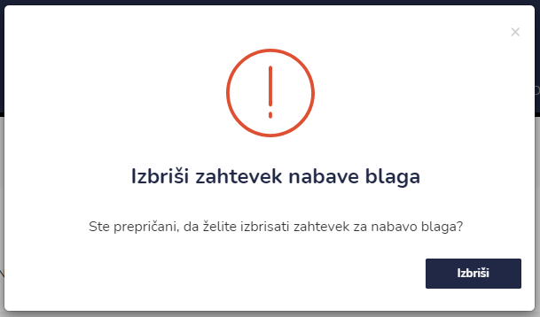

# Nabava blaga


[uporaba-tabel-iskanje-sortiranje-izvozi-tiskanje.md](../ostalo/uporaba-tabel-iskanje-sortiranje-izvozi-tiskanje.md)





| Ime polja        | Opis polja                                                            |
| ---------------- | --------------------------------------------------------------------- |
| **Datum**        | S pomočjo spustnega koledarja izberite datum.                         |
| **Namen**        | Napišite namen zahtevka.                                              |
| **Dobavitelj**   | Iz spustenga seznama izberite dobavitelja.                            |
| **Odobril**      | Iz spustenga seznama izberite odobritelja.                            |
| **Preglagatelj** | Iz spustenga seznama izberite predlagatelja.                          |
| **Naročil**      | Iz spustenga seznama izberite naročnika.                              |
| **Vodja nabave** | Iz spustenga seznama izberite vodjo nabave.                           |
| **Odpremil**     | Iz spustenga seznama izberite odpremitelja                            |
| **Konto**        |                                                                       |
| **Datoteke**     | Tu lahko dodate še dodatene datoteke, katere so pomembne za naročilo. |








s klikom na **Potrdi**&#x20;

se pri ikonah dodatno spremeni ikona iz, POTRDI v **REALIZIRANO** .

Status naročenega blaga pa iz AKTIVNO  v **POTRJENO.**




S klikom na&#x20;

se status dobavljenega blaga spremeni&#x20;

iz POTRJENO  v **REALIZIRANO**  .




Napišite vrsto blaga, količino ter ceno (brez ddv) in s klikom na **Dodaj** dodate nov vnos **blaga**.

#### **Izbris vpisa**

Za izbris posamezne postavke kliknite na  pri posamezni vrstici.

#### **Urejanje vpisa**

Za urejenje posamezne postavke kliknite na  pri posamezni vrstici in začnite urejati vpis.

Ko zaključite z urejanje postavke kliknite **Dodaj.**

S klikom na **Zapri** se vrnete na začetni pogled Nabave blaga.




S klikom na **Pošlji na email**  se odpre okno **Pošlji naročilnico (PDF)**

s pomočjo spustnega seznama izberite stranko ali zaposlenega, kateremu boste poslali delovni nalog.

V elektronski nabiralnik bo prejemnik prejel email z izbrano naročilnico (naročilnica je v priponki maila).‌




