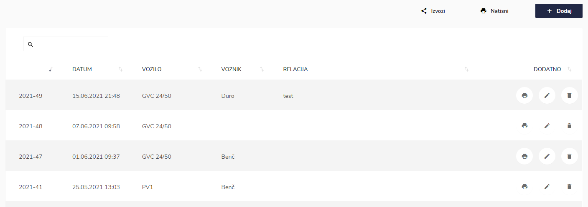
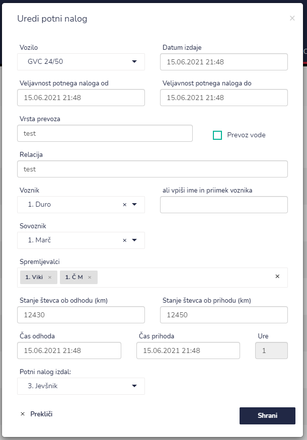
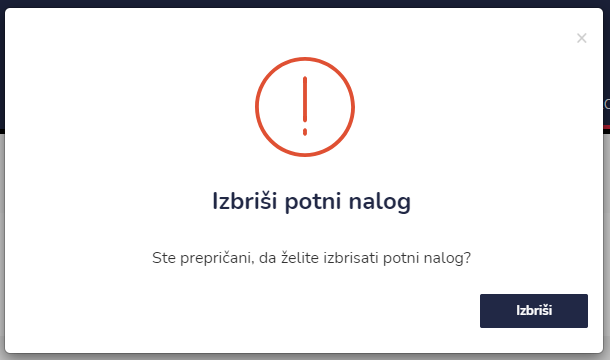
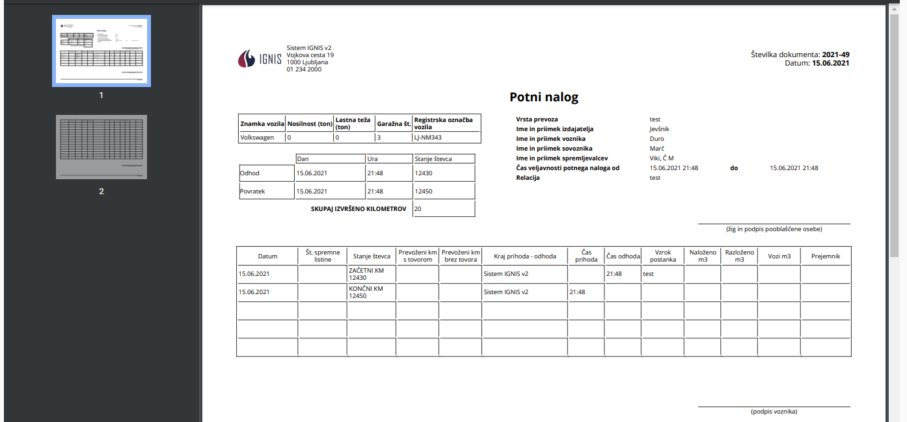

# Potni nalogi


[uporaba-tabel-iskanje-sortiranje-izvozi-tiskanje.md](../ostalo/uporaba-tabel-iskanje-sortiranje-izvozi-tiskanje.md)





| Ime polja                            | Opis polja                                                                                |
| ------------------------------------ | ----------------------------------------------------------------------------------------- |
| **Vozilo**                           | S pomočjo spustnega seznama izberite vozilo.                                              |
| **Datum izdaje**                     | S pomočjo spustnega koledarja izberite datum in uro izdaje potnega naloga.                |
| **Veljavnost potnega naloga od**     | S pomočjo spustnega koledarja izberite datum in uro začetek veljavnosti potnega naloga.   |
| **Veljavnost potnega naloga do**     | S pomočjo spustnega koledarja izberite datum in uro zaključek veljavnosti potnega naloga. |
| **Vrsta prevoza**                    | Napišite vrsto prevoza                                                                    |
| **Prevoz vode**                      | Označite če gre za prevoz vode                                                            |
| **Relacija**                         | Napišite relacijo.                                                                        |
| **Voznik**                           | Vpišite voznika s pomočjo spustnega seznama ga izberite.                                  |
| **ali vpiši ime in priimek voznika** | Tu lahko vpišite ime in priimek voznika, če tega ni v seznamu.                            |
| **Spremljevalci**                    | S pomočjo spustnega dodajete spremljevalce.                                               |
| **Stanje števca ob odhodu (km)**     | Vpišite stanje števca v kilometrih ob obhodu.                                             |
| **Stanje števca ob prihodu (km)**    | Vpišite stanje števca v kilometrih ob prihodu.                                            |
| **Čas odhoda**                       | S pomočjo spustnega koledarja izberite datum in uro odhoda.                               |
| **Čas prihoda**                      | S pomočjo spustnega koledarja izberite datum in uro prihod.                               |
| **Ure**                              | Z vpisom datuma in ure odhoda in prihoda se ure same izračunajo.                          |
| **Potni nalog izdal:**               | Iz spustenga seznama izberite osebo, katera je izdala potni nalog.                        |











​‌
