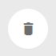
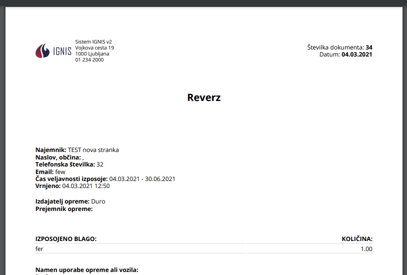

# Reverzi

Tu dostopate do seznam reverzov.


[uporaba-tabel-iskanje-sortiranje-izvozi-tiskanje.md](../ostalo/uporaba-tabel-iskanje-sortiranje-izvozi-tiskanje.md)





| Ime polja                           | Opis polja                                                                      |
| ----------------------------------- | ------------------------------------------------------------------------------- |
| **Stranka**                         | S pomočjo spustnega seznama izberite stranko.                                   |
| **Email**                           | Napišite elektronski naslov.                                                    |
| **Telefon**                         | Vpišite telefonsko številko,                                                    |
| **Ulica**                           | Napišite ulico.                                                                 |
| **Hišna št.**                       | Vpišite še hišno številko.                                                      |
| **Občina**                          | S pomočjo spustnega seznam izberite občino.                                     |
| **Namen uporabe opreme ali vozila** | Napišite kratek opis namena uporaben opreme ali blaga, katerega boste posodili. |
| **Datum izposoje**                  | S pomočjo spustnega koledarja izberite datum izposoje.                          |
| **Datum predvidene vrnitve**        | S pomočjo spustnega koledarja izberite datum naslednjega servisa.               |
| **Izdajatelj oprme**                | Iz spustenga seznama izberite kdo je izdajatelj opreme.                         |
| **Prejemnik opreme**                | Napišite prejmnika opreme                                                       |







Če želite izvesti elektronski podpis, lahko to storite s klikom na ikono **Podpis prejemnika**,&#x20;

kjer se odpre okno za Podpis prejemnika

prejemnik se podpiše v okno

s klikom na **POTRDI** se podpis shrani.&#x20;

Če je posamezen reverz že podpisan s strani prejemnika, to lahko vidite, ker ikone za podpis ni več na voljo.





S pomočjo spustnega seznama izberite uporabljene materiale oz. opravljene storitve. Napišite količino ter s klikom na **Dodaj** dodate nov vnos **blaga**.

Za izbris posamezne postavke kliknite na **X** pred posamezno vrstico.

S klikom na **Zapri** se vrnete na začetni pogled Reverzov.







### Kakšen status ima REVERZ?

V kakšnem statusu je reverz lahko vidite v stolpcu **Status**.

| Status                       | Opis                                         |
| ---------------------------- | -------------------------------------------- |
| **VRNJERNO**                 | Oprema je vrnjena.                           |
| **IZPOSOJENO**               | Oprema je na izposoji.                       |
| **IZPOSOJENO** :exclamation: | Operma je na izposoji in zamuja z vrnitvijo. |
