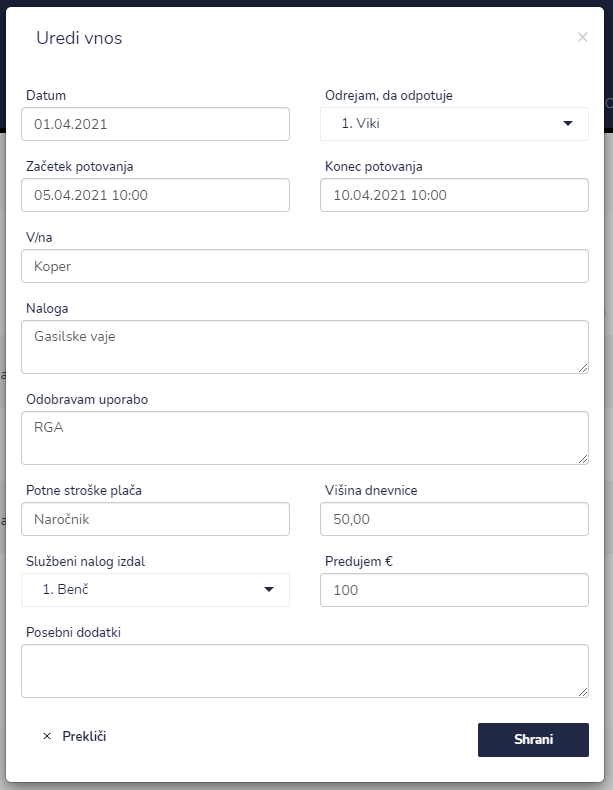

# Službeno potovanje


[uporaba-tabel-iskanje-sortiranje-izvozi-tiskanje.md](../ostalo/uporaba-tabel-iskanje-sortiranje-izvozi-tiskanje.md)





| Ime polja                | Opis polja                                                                                                        |
| ------------------------ | ----------------------------------------------------------------------------------------------------------------- |
| **Datum**                | S pomočjo spustnega koledarja izberite datum.                                                                     |
| **Začetek potovanja**    | S pomočjo spustnega koledarja izberite datum in uro začetek službenga potovanja.                                  |
| **Konec potovanja**      | S pomočjo spustnega koledarja izberite datum in uro konec službenga potovanja.                                    |
| **V/na**                 | Napišite kje je službeno potovanje.                                                                               |
| **Naloga**               | Opišite nalogo službenega potovanja.                                                                              |
| **Odobravam uporabo**    | Napišite ali se v času izvajanja službenega potovanja potrebna opremo/blago/potrdila za nemoteno izvedbo le tega. |
| **Potne stroške plača**  | Navedite kdo je plačnik službenega potovanja.                                                                     |
| **Višina dnevnice**      | Napište višino dnevnice.                                                                                          |
| **Službeni nalog izdal** | S pomočjo spustnega seznama izberite osebo, katera je izdala delovni nalog.                                       |
| **Predujem €**           | Zapišite višino predujem v €.                                                                                     |
| **Posebni dodatki**      | Zapišite ali so potrebni še kakšni posebni dodatki, kateri so potrebni za službeno potovanje.                     |











​‌
