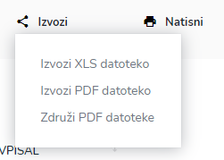
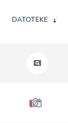
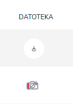
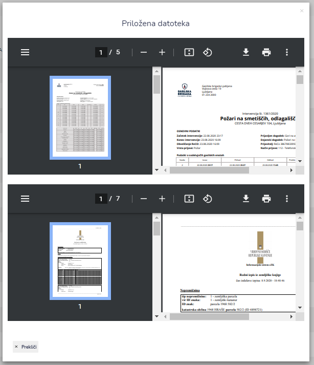

# Uporaba tabel (iskanje, sortiranje, izvozi, tiskanje)

### Iskanje&#x20;

S pomočjo iskalnika lahko iščete po vseh stolpcih. Iskalnik je izredno napreden, saj ni potrebno vpisati celotne besede. Iskalnik namreč išče tudi po delih iskane besede. Še več, iščete lahko po več stolpcih hkrati. Na primer iskalni niz "**30.04. ELS**" bo vrnil spodnji rezultat (stranka "**ELS Aplikacije**" in datum "**30.04.XXXX**").

.png>)

### Sortiranje

S klikom na stolpec lahko sortirate seznam.

### Tiskanje in izvoz

\
S klikom na ikono **Izvozi** XLS datoteko, izvozite XLS datoteko:‌

S klikom na ikono **Izvozi** PDF datoteko, izvozite PDF datoteko:

### Pregled priloženih datotek

