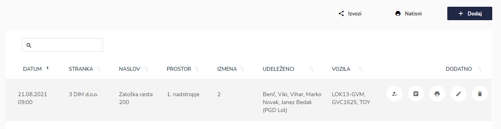
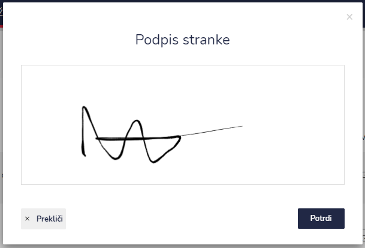

# Napovedane požarne straže


[uporaba-tabel-iskanje-sortiranje-izvozi-tiskanje.md](../ostalo/uporaba-tabel-iskanje-sortiranje-izvozi-tiskanje.md)





| Ime polja                             | Opis polja                                                                                      |
| ------------------------------------- | ----------------------------------------------------------------------------------------------- |
| **Stranka**                           | Iz spustnega seznama izberite stranko.                                                          |
| **Prostor**                           | Iz spustnega seznama izberite prostor.                                                          |
| **Ime nevarne snovi**                 | Napišite ime nevarne snovi.                                                                     |
| **Oznaka nevarnosti**                 | Napišite oznako nevarnosti, katera ima snov                                                     |
| **Datum**                             | S pomočjo spustnega koledarja izberite dan in uro začetka.                                      |
| **UN številka**                       | Napišite UN številko.                                                                           |
| **Izmena**                            | Označite izmeno                                                                                 |
| **Udeleženci na požarni straži**      | S pomočjo spustnega seznama izberite udeležence na požarni straži.                              |
| **Vozila**                            | S pomočjo spustnega seznama izberite vozila.                                                    |
| **Opomba pred začetkom**              | Napišite, če so kakšne opombe pred začetkom požarne straže.                                     |
| **Opomba po koncu**                   | Napišite, če so kakšne opombe po koncu požarne straže.                                          |
| **Ura rednega zaključka**             | S pomočjo spustnega koledarja izberite dan in uro začetka.                                      |
| **Ura zaključka zaradi intervencije** | S pomočjo spustnega koledarja izberite dan in uro zaključka požarne straže zaradi intervencije. |









.PNG>)

stranka se podpiše v okno

s klikom na **POTRDI** se podpis shrani.

Če ima posamezna požarna straža že podpis naročnika, to lahko vidite, ker ni več ikone za podpis stranke.












