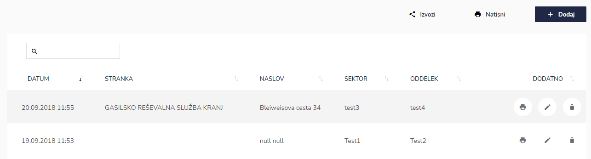
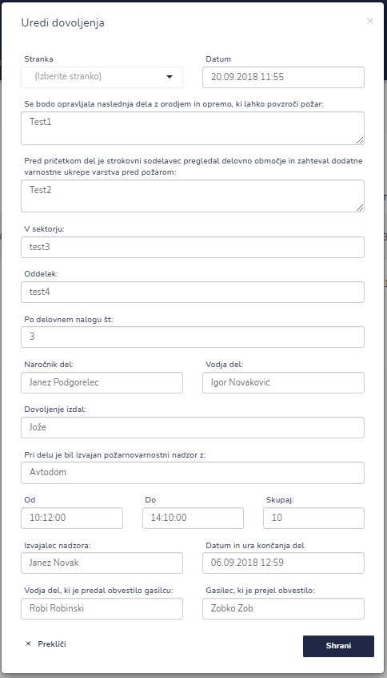
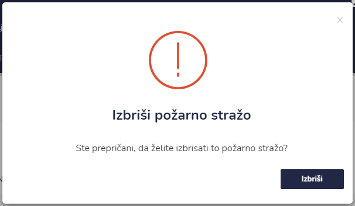
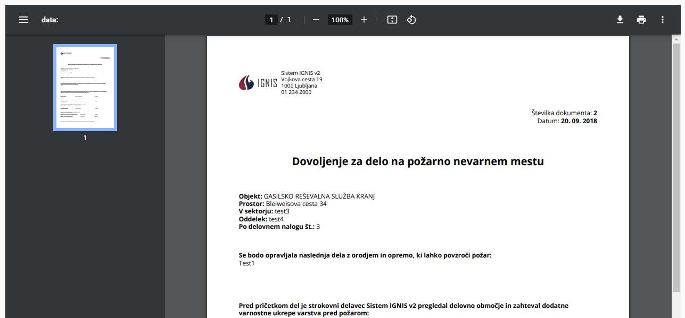

# Seznam dovoljenj za delo


[uporaba-tabel-iskanje-sortiranje-izvozi-tiskanje.md](../ostalo/uporaba-tabel-iskanje-sortiranje-izvozi-tiskanje.md)





| Ime polja                                                                                                                         | Opis polja                                                 |
| --------------------------------------------------------------------------------------------------------------------------------- | ---------------------------------------------------------- |
| **Stranka**                                                                                                                       | Iz spustnega seznama izberite stranko.                     |
| **Datum**                                                                                                                         | S pomočjo spustnega koledarja izberite dan in uro začetka. |
| **Se bodo opravljala naslednja dela z orodjem in opremo, ki lahko povzroči požar**                                                |                                                            |
| **Pred pričetkom del je strokovni sodelavec pregledal delovno območje in zahteval dodatne varnostne ukrepe varstva pred požarom** |                                                            |
| **V sektorju**                                                                                                                    |                                                            |
| **Oddelek**                                                                                                                       |                                                            |
| **Po delovnem nalogu št.**                                                                                                        | Vpišite številko delovnega naloga.                         |
| **Naročnik del**                                                                                                                  | Vpišite naročnika del.                                     |
| **Vodja del**                                                                                                                     | Vpišite vodjo del.                                         |
| **Dovoljenje izdal**                                                                                                              | Vpišite kdo je izdal dovoljenje.                           |
| **Pri delu je bil izvajan požarnovarnostni nadzor z**                                                                             |                                                            |
| **Od**                                                                                                                            | S pomočjo spustnega seznama izberite uro.                  |
| **Do**                                                                                                                            | S pomočjo spustnega seznama izberite uro.                  |
| **Izvajalec nadzora**                                                                                                             | Vpišite izvajalca nadzora                                  |
| **Datum in ura končanja del**                                                                                                     | S pomočjo spustnega koledarja izberite dan in uro začetka. |
| **Vodja del, ki je predal obvestilo gasilcu**                                                                                     | Vpišite vodjo, katera je predala obvestilo gasilcu         |
| **Gasilec, ki je prejel obvestilo**                                                                                               | Vpišite gasilca, kateri je prijel obvestilo                |












