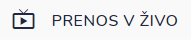

# PRENOS V ŽIVO

.png>)

### Navodila za prenos v živo

Preden greste v program DJI Pilot, na telefonu vključite mobilne podatke, naredite dostopno točko in se povežete na vašo WiFi točk&#x6F;**.**

Nato greste v programu DJI Pilot desno zgoraj v menu in izberete "tri pikice" spodaj.

Kliknete na LiveStream in Customize Live Stream

Vnesete povezavo **rtmp://drone.ignis112.si/ljubljana/live\*.**


\*ljubljana zamenjate z vašim naslovom. Točen naslov boste prejeli, ko za vas vzpostavimo strežnik za prenos v živo.


Ko se požene prenos, levo zgoraj kliknete modro ikono, kjer izklopite prenos zvoka (Turn On Audio) in nastavite Adjust Bit Rate na 20% (993.0 Kbps). Nato kliknete CANCEL. Za prekinitev prenosa slike, kliknete STOP LIVE STREAMING.

IGNIS dispečerja avtomatsko opozori, da je drone (ali prenos iz telefona) aktiven. S klikom na zeleni gumb, se odpre stran, kjer je možen ogled slike v živo, ter pregled po arhivu posnetkov.\


Drona **NIKOLI** ne upravljamo s pogledom na sliko, ki jo prenašamo preko prenosa v živo. Zavedati se je potrebno, da prenos slike zaostaja od 5 do 15 sekund, odvisno od kvalitete interneta na terenu in ostalih dejavnikov, ter lahko pride do nesreče. Prenos slike je namenjen centrali in štabu, upravitelj drona pa se mora posluževati ekrana CRYSTALSKY oziroma vizualnega letenja.


Hkrati, ko se izvaja prenos slike, se tudi snema na strežnik. Tako je možen ogled posnetkov za nazaj.


Zaradi **GDPR** zakona arhiva posnetkov ne vidijo vsi, ampak samo tisti, ki ima dovoljenje za to v pravicah uporabnika.


Za prenos v živo iz telefona ali tabličnega računalnika lahko naložite brezplačno aplikacijo **Larix**.
