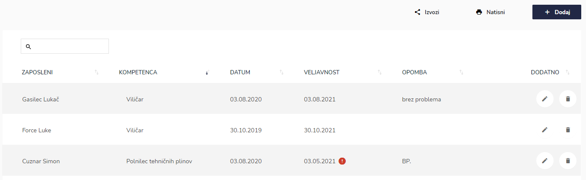
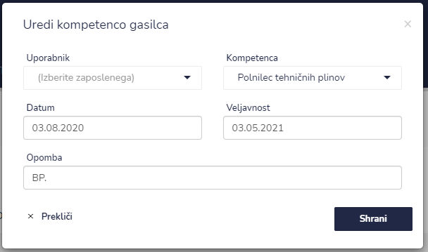
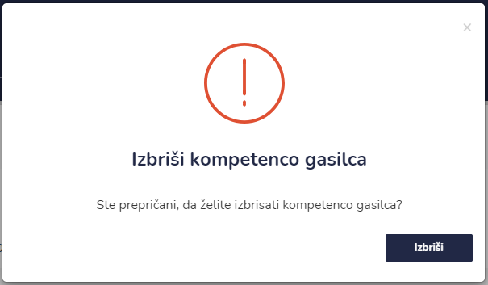

# Kompetence


[uporaba-tabel-iskanje-sortiranje-izvozi-tiskanje.md](../ostalo/uporaba-tabel-iskanje-sortiranje-izvozi-tiskanje.md)





| Ime polja      | Opis polja                                                                      |
| -------------- | ------------------------------------------------------------------------------- |
| **Uporabnik**  | Iz spustnega seznama izberite uporabnika/zaposlenega.                           |
| **Kompetenca** | S pomočjo spustnega koledarja izberite kompetenco.                              |
| **Datum**      | S pomočjo spustnega koledarja izberite dan in uro datum zdravniškega pregleda.  |
| **Veljavnost** | S pomočjo spustnega koledarja izberite dan in uro datum veljavnosti kompetence. |
| **Opomba**     | Dopišite opombe.                                                                |







### Veljavnost kompetenc


Ali je veljavnost kompetence veljavena pri posameznem zaposlenem lahko vidite pod **VELJAVNOST**

Če je veljavnost kompetence potekla je poleg datuma še rdeč klicaj.

Če želite popraviti datum veljavnosti, to naredite s sklikom na ikono **UREDI** in tu popravite oz. uredite datum.&#x20;

