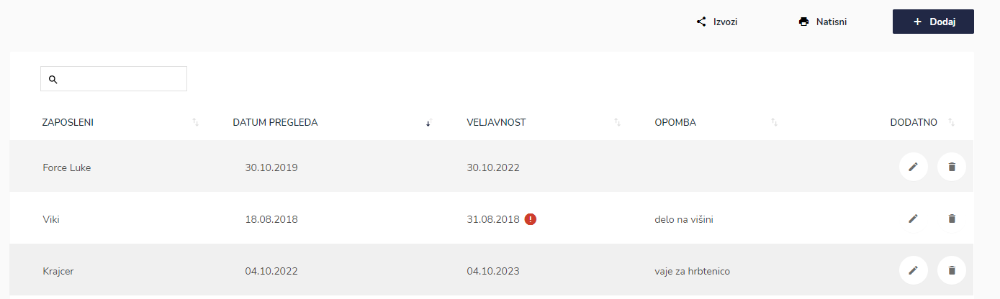
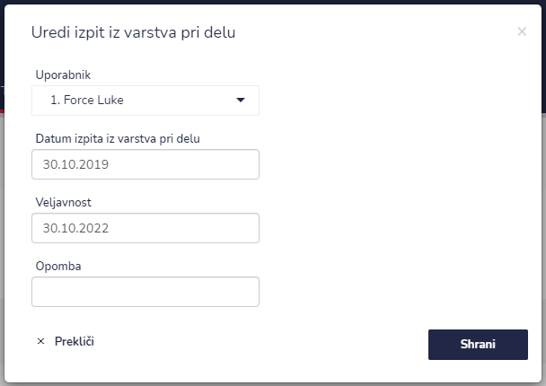
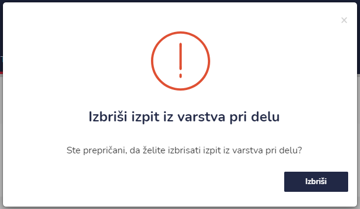
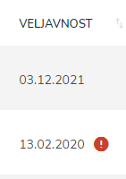

# Varstvo pri delu


[uporaba-tabel-iskanje-sortiranje-izvozi-tiskanje.md](../ostalo/uporaba-tabel-iskanje-sortiranje-izvozi-tiskanje.md)





| Ime polja                            | Opis polja                                                                                      |
| ------------------------------------ | ----------------------------------------------------------------------------------------------- |
| **Uporabnik**                        | Iz spustnega seznama izberite uporabnika/zaposlenega.                                           |
| **Datum izpita iz varstva pri delu** | S pomočjo spustnega koledarja izberite dan in uro datum izpita iz varstva pri delu.             |
| **Veljavnost**                       | S pomočjo spustnega koledarja izberite dan in uro datum veljavnosti izpita iz varstva pri delu. |
| **Opomba**                           | Dopišite opombe.                                                                                |







### Veljavnost izpita iz varstva pri delu


Ali je veljavnost izpit iz varstva pri delu veljaven pri posameznemu zaposlenemu lahko vidite pod **VELJAVNOST**

Če je veljavnost izpita iz varstva pri delu potekla je poleg datuma še rdeč klicaj.

Če želite popraviti datum veljavnosti, to naredite s sklikom na ikono **UREDI** in tu popravite oz. uredite datum.&#x20;


