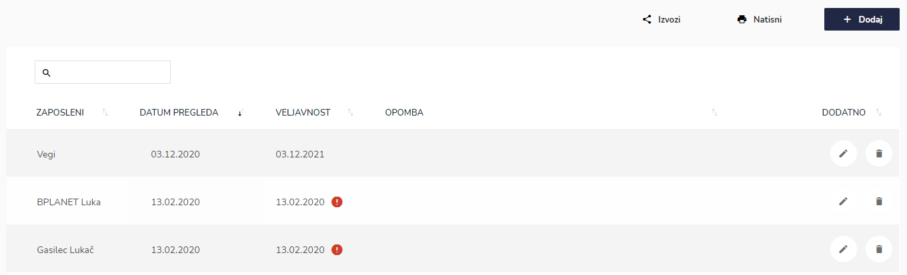
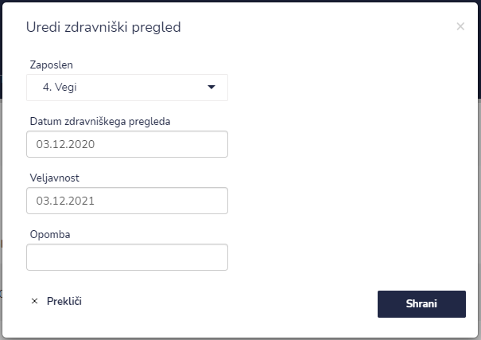
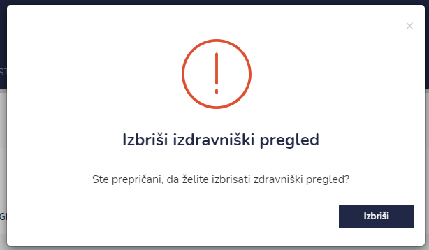

# Zdravniški pregledi


[uporaba-tabel-iskanje-sortiranje-izvozi-tiskanje.md](../ostalo/uporaba-tabel-iskanje-sortiranje-izvozi-tiskanje.md)





| Ime polja                       | Opis polja                                                                                 |
| ------------------------------- | ------------------------------------------------------------------------------------------ |
| **Zaposleni**                   | Iz spustnega seznama izberite zaposlenega.                                                 |
| **Datum zdravniškega pregleda** | S pomočjo spustnega koledarja izberite dan in uro datum zdravniškega pregleda.             |
| **Veljavnost**                  | S pomočjo spustnega koledarja izberite dan in uro datum veljavnosti zdravniškega pregleda. |
| **Opomba**                      | Dopišite opombe.                                                                           |







### Veljavnost zdravniškega pregleda


Ali je veljavnost zdravniškega pregleda veljaven pri posameznemu zaposlenemu lahko vidite pod **VELJAVNOST**

Če je veljavnost zdravniškega pregleda potekla je poleg datuma še rdeč klicaj.

Če želite popraviti datum veljavnosti, to naredite s klikom na ikono **UREDI** in tu popravite oz. uredite datum.&#x20;


