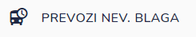
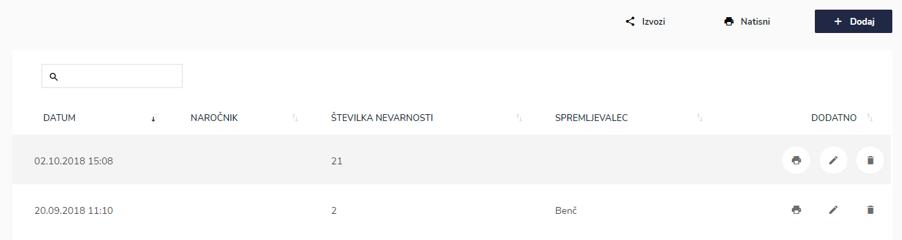
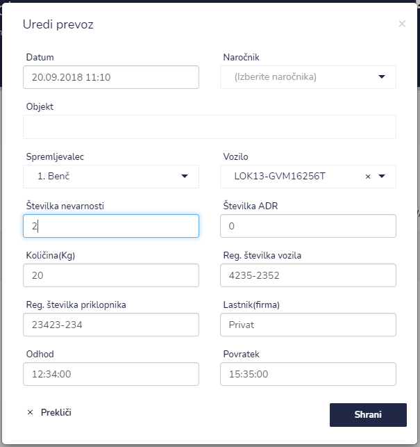
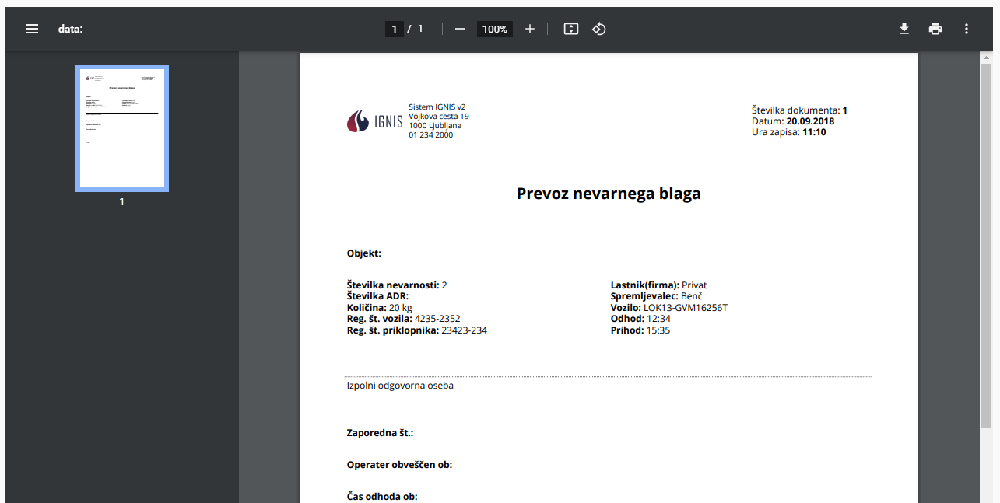

# PREVOZI NEVARNEGA BLAGA


[uporaba-tabel-iskanje-sortiranje-izvozi-tiskanje.md](ostalo/uporaba-tabel-iskanje-sortiranje-izvozi-tiskanje.md)





| Ime polja                     | Opis polja                                                   |
| ----------------------------- | ------------------------------------------------------------ |
| **Datum**                     | S pomočjo spustnega koledarja izberite datum in uro prevoza. |
| **Naročnik**                  | Napišite naročnika.                                          |
| **Objekt**                    |                                                              |
| **Spremljevalec**             | S pomočjo seznama izberite spremljevalca.                    |
| **Vozilo**                    | Izberite vozilo                                              |
| **Številka nevarnosti**       |                                                              |
| **Številka ADR**              |                                                              |
| **Količina(Kg)**              |                                                              |
| **Reg. številka vozila**      | Vpišite registrsko številko vozila.                          |
| **Reg. številka priklopnika** | Vpišite registrsko številko priklopnika.                     |
| **Lastnik(firma)**            | Napišite lastnika oz. firmo vozila.                          |
| **Odhod**                     | Vpišite čas odhoda.                                          |
| **Povratek**                  | Vpišite čas povratka.                                        |





.png>)







