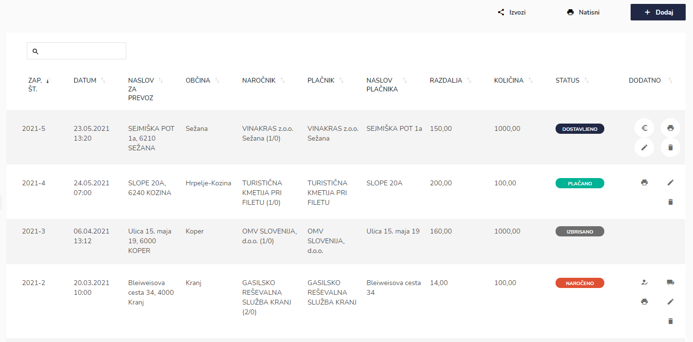

# Pregled prevozov vode


[uporaba-tabel-iskanje-sortiranje-izvozi-tiskanje.md](../ostalo/uporaba-tabel-iskanje-sortiranje-izvozi-tiskanje.md)





| Ime polja                   | Opis polja                                                                                              |
| --------------------------- | ------------------------------------------------------------------------------------------------------- |
| **Datum sprejema naročila** | S pomočjo spustnega koledarja izberite dan in uro začetka.                                              |
| **Datum prevoza**           | S pomočjo spustnega koledarja izberite dan in uro začetka.apišite ime nevarne snovi.                    |
| **Naročnik**                | S pomočjo spustnega seznama izberite naročnika.                                                         |
| **Plačnik**                 | Izberite plačnika s pomočjo spustnega seznama.                                                          |
| **Naslov za prevoz**        | Napišite naslov dostave vode.                                                                           |
| **Občina**                  | S pomočjo spustnega seznama izberite občino.                                                            |
| **Razdalja (km)**           | Zapišite razdaljo v km.                                                                                 |
| **Količina (m3)**           | Napišite količino vode v m3.                                                                            |
| **Voznik**                  | S pomočjo spustnega seznama izberite voznika.                                                           |
| **Voda je pitna**           | Označite ali je voda pitna ali ne. Glede na označneno se na delovnem nalogu izbiše dodatne obrazložitve |
| **Opombe**                  | Zapišite ali so še kakšne dodatne opombe.                                                               |








Če želite izvesti elektronski podpis, lahko to storite s klikom na ikono **Podpis naročnika**,&#x20;

.PNG>)

stranka se podpiše v okno

s klikom na **POTRDI** se podpis shrani.&#x20;

Če je posamezna dostava vode že podpisana s stani naročnika, to lahko vidite, ker ikone za podpis ni več na voljo.





.PNG>)

s klikom **Potrdi** se spremeni status v **DOSTAVLJENO.**&#x20;




.PNG>)

s klikom na **Potrdi** se status spremeni v **PLAČANO,** če želite zaznačiti, da je bila dostava vpde plačana.




se generira pdf zapis, delovni nalog o prevozu pitne vode


Če je voda pitna je na delovnem nalogu dodana še **izjava o ustreznosti prevoza pitne vode**&#x20;





### Kaj pomenijo statusi pri posameznem prevozu vode?

| Status          | Pomen                                            |
| --------------- | ------------------------------------------------ |
| **NAROČENO**    | se prikaže kadar je bil naročen nov prevoz vode. |
| **DOSTAVLJENO** | se prikaže se kadar je bil dostavljena voda      |
| **PLAČANO**     | kadar je prevoz vode plačan s strani naročnika   |
| **IZBRISANO**   | če je bil prevoz vode izbrisan                   |

## Potek celotnega postopeka od naročanja, dostave, podpisa in plačila prevoza vode?

Ko stranka oz. posameznik naroči prevoz vode dobi naročilo status **NAROČENO.**&#x20;

Ko se izvede dostava vode na naslov naročnika se s klikom na ikono **Dostavljeno**&#x20;

odpre pojavno okno Dostava vode

s klikom **Potrdi** se spremeni status v **DOSTAVLJENO**.&#x20;

Če je stranka oz. posameznik plačal prevoz s klikom na ikono **Plačano**&#x20;

odpre okno Plačilo prevoza vode

.PNG>)

s klikom na **Potrdi** se status spremeni v **PLAČANO.**&#x20;

Če ima stranka možnost elektronsko podpisa, lahko to storite s klikom na ikono **Podpis naročnika**,&#x20;

kjer se odpre okno za Podpis stranke

.PNG>)

stranka se podpiše v okno

s klikom na **POTRDI** se podpis shrani. Če je posamezna dostava vode že podpisana s stani naročnika, to lahko vidite, ker ikone za podpis ni več na voljo.

