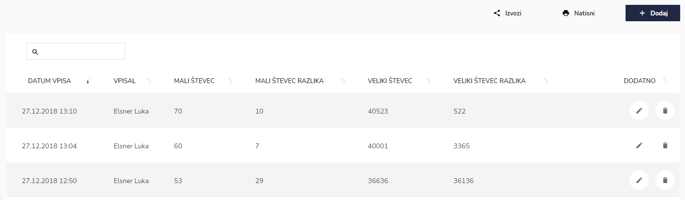
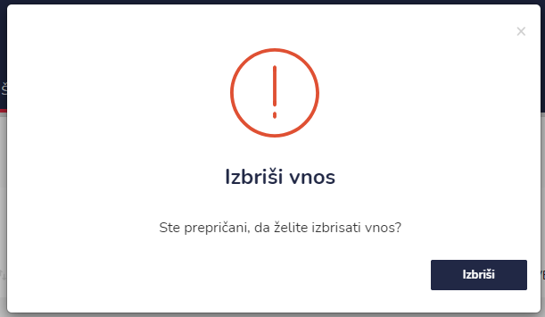

# Števec


[uporaba-tabel-iskanje-sortiranje-izvozi-tiskanje.md](../ostalo/uporaba-tabel-iskanje-sortiranje-izvozi-tiskanje.md)





.PNG>)

| Ime polja         | Opis polja |
| ----------------- | ---------- |
| **Mali števec**   |            |
| **Veliki števec** |            |







###
