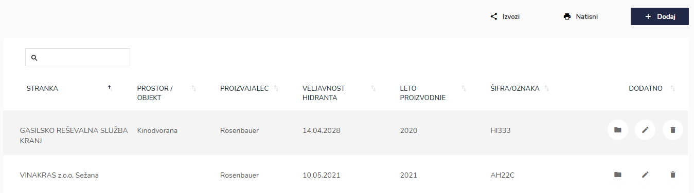

# Seznam hidrantov

Tu dostopate do seznama hidrantov.


[uporaba-tabel-iskanje-sortiranje-izvozi-tiskanje.md](../../ostalo/uporaba-tabel-iskanje-sortiranje-izvozi-tiskanje.md)





| Ime polja               | Opis polja                                           |
| ----------------------- | ---------------------------------------------------- |
| **Stranka**             | S pomočjo spustnega seznama izberite stranko.        |
| **Prostor / objekt**    | S pomočjo spustnega seznama izberite prostor/objekt  |
| **Proizvajalec**        | Iz spustnega seznama izberite proizvajalca.          |
| **Veljavnost hidranta** | S pomočjo spustnega koledarja izberite datum.        |
| **Šifra/oznaka**        | Napišite oznako/šifro hidranta.                      |
| **Leto proizvodnje**    | Napišite leto proizvodnje hidranta.                  |








Tu lahko dodajate servis, natisnete nalepke o izpravnosti ali pregledujete dokumente posameznih pregledov. Uporabite iskalnik kader želite poiskati točno določen datum, stranko, šifro/oznako, serviserja ali pa kdo je odobril delo.

.PNG>)


