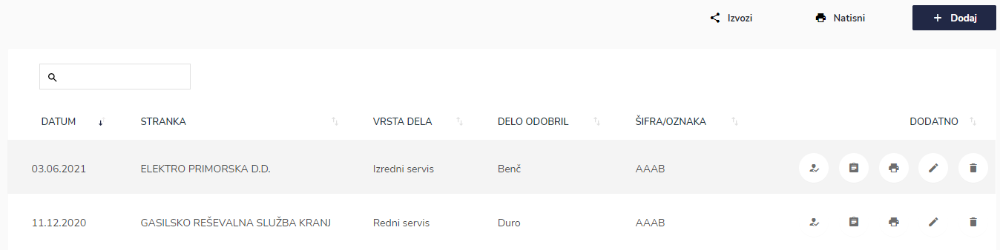
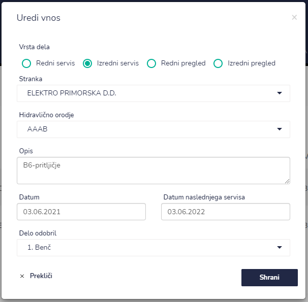
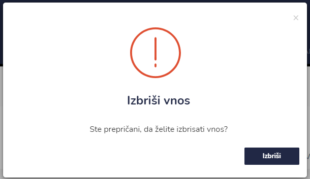
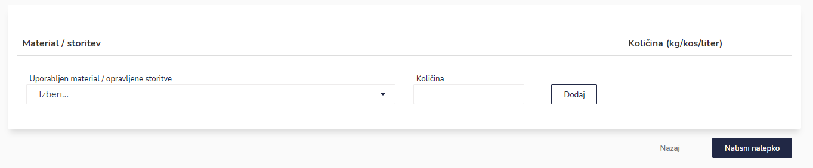
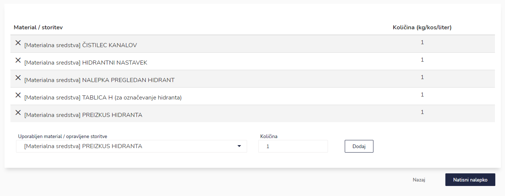
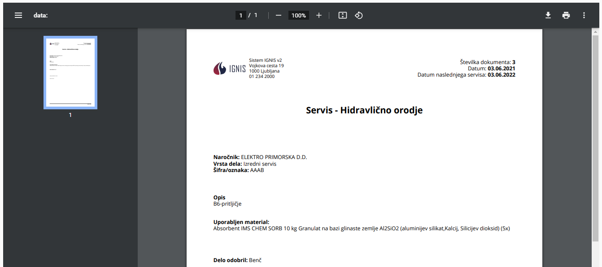

# Servisi hidravlično orodje

Tu dostopate do servisov hidravličnega orodja.


[uporaba-tabel-iskanje-sortiranje-izvozi-tiskanje.md](../../ostalo/uporaba-tabel-iskanje-sortiranje-izvozi-tiskanje.md)





| Ime polja                     | Opis polja                                                                                                                       |
| ----------------------------- | -------------------------------------------------------------------------------------------------------------------------------- |
| **Vrsta dela**                | 
Označite za kakšno vrsto dela gre. 

Na voljo imate: redni servis, izredni servis, redni pregled in izredni pregled.
 |
| **Stranka**                   | S pomočjo spustnega seznama izberite stranko.                                                                                    |
| **Hidravlično orodje**        | Iz spustnega seznama izberite hidravlično orodje.                                                                                |
| **Opis**                      | Dodajte opis.                                                                                                                    |
| **Datum**                     | S pomočjo spustnega koledarja izberite datum.                                                                                    |
| **Datum naslednjega servisa** | S pomočjo spustnega koledarja izberite datum naslednjega servisa.                                                                |
| **Delo odobril**              | Iz spustenga seznama izberite kdo je delo odobril.                                                                               |









.PNG>)

stranka se podpiše v okno

s klikom na **POTRDI** se podpis shrani.&#x20;

Če je posamezna servis že podpisan s strani stranke, to lahko vidite, ker ikone za podpis ni več na voljo.





S pomočjo spustnega seznama izberite uporabljene materiale oz. opravljene storitve. Napišite količino (enota kg/kos/liter) ter s klikom na **Dodaj** dodate nov vnos materiala oz. storitve.

Za izbris posamezne postavke kliknite na **X** pred posamezno vrstico.







​
