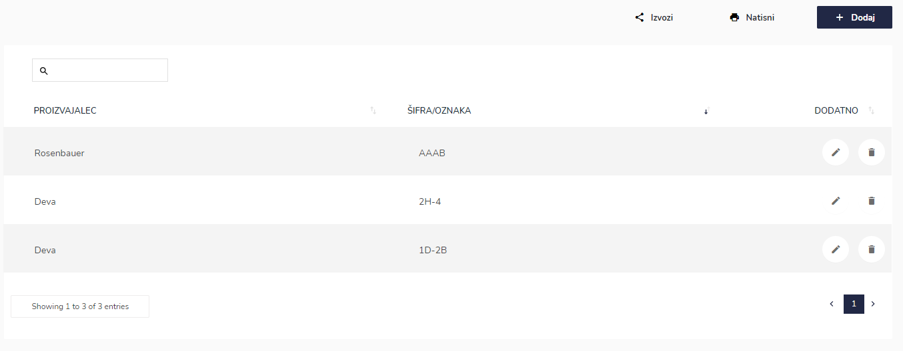

# Seznam hidravlična orodje

Tu dostopate do seznama hidravličnih orodij.


[uporaba-tabel-iskanje-sortiranje-izvozi-tiskanje.md](../../ostalo/uporaba-tabel-iskanje-sortiranje-izvozi-tiskanje.md)





| Ime polja        | Opis polja                                  |
| ---------------- | ------------------------------------------- |
| **Proizvajalec** | Iz spustnega seznama izberite proizvajalca. |
| **Šifra/oznaka** | Napišite oznako/šifro hidravličnega orodja. |







