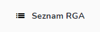
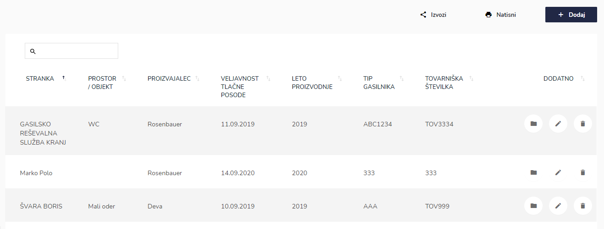
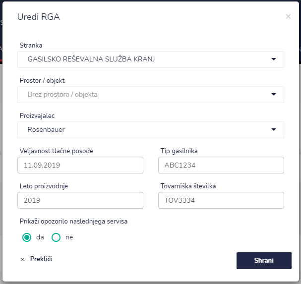
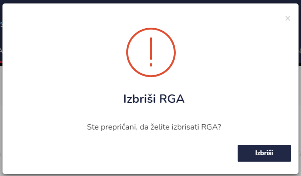
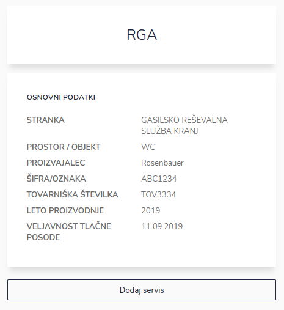
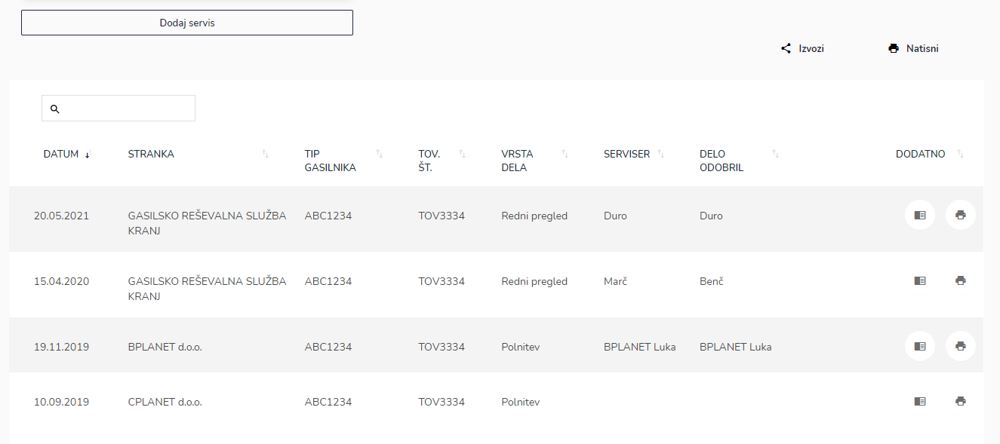

# Seznam RGA

Tu dostopate do seznama RGA.


[uporaba-tabel-iskanje-sortiranje-izvozi-tiskanje.md](../../ostalo/uporaba-tabel-iskanje-sortiranje-izvozi-tiskanje.md)





| Ime polja                                 | Opis polja                                                     |
| ----------------------------------------- | -------------------------------------------------------------- |
| **Stranka**                               | S pomočjo spustnega seznama izberite stranko.                  |
| **Prostor / objekt**                      | Iz spustnega seznama izberite prostor / objekt.                |
| **RGA**                                   | Iz spustnega seznama izberite RGA.                             |
| **Proizvajalec**                          | Iz spustnega seznama izberite proizvajalca.                    |
| **Veljavnost tlačne posode**              | S pomočjo spustnega koledarja izberite datum.                  |
| **Tip gasilnika**                         | Opišite tip RGA.                                               |
| **Leto proizvodnje**                      | Napišite leto proizvodnje RGA.                                 |
| **Tovarniška številka**                   | Napišite tovarniško številko iz RGA.                           |
| **Prikaži opozorila naslednjega servisa** | Označite ali želite prikazovanje opozoril naslednjega servisa. |








Tu lahko dodajate servis, natisnete nalepke o izpravnosti ali pregledujete dokumente posameznih pregledov. Uporabite iskalnik kader želite poiskati točno določen datum, stranko, tip gasilnika, tovarniško številko, vrsto dela, serviserja ali pa kdo je odobril delo.




