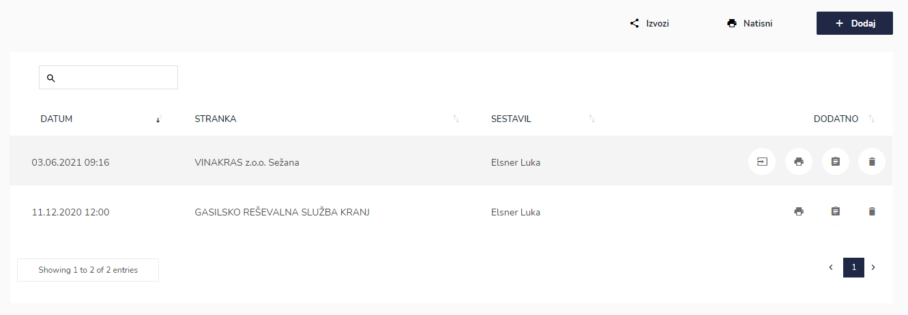
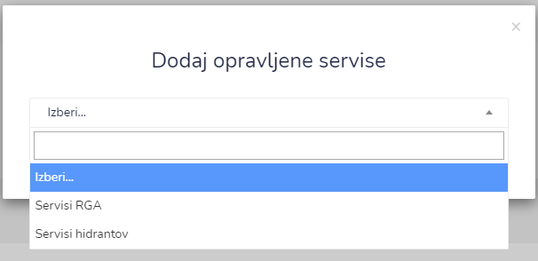
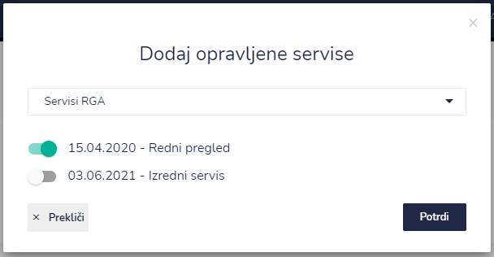
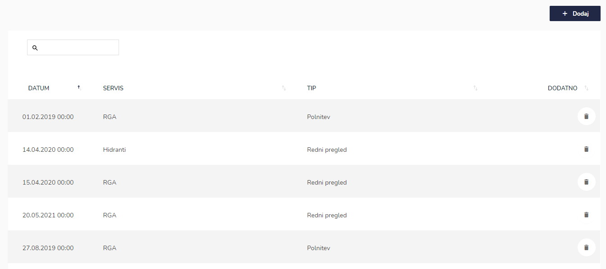
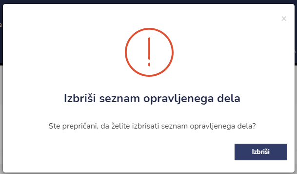
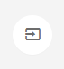
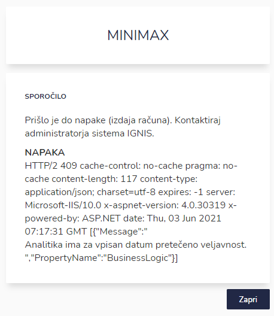
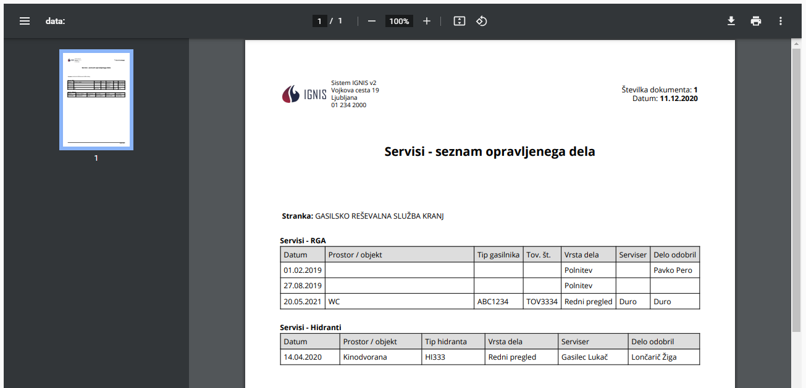

# Seznam opravljenega dela

Tu dostopate do seznama opravljenih del.


[uporaba-tabel-iskanje-sortiranje-izvozi-tiskanje.md](../ostalo/uporaba-tabel-iskanje-sortiranje-izvozi-tiskanje.md)




​‌

.png>)

Iz spustnega seznama izberite stranko. Po izboru kliknite na **Potrdi.** Ta je sedaj viden na seznamu opravljenega dela. &#x20;

V naslednjem koraku izberete opravljene servise katere želite shraniti v "paket".

.PNG>)

S pomočjo spustnega seznama izberite tip servisov.

Ko ste izbrali tip servisa, izberite še kateri opravljen servis oz. pregled želite uvrstiti na seznam opravljenih del.

S klikom na **Potrdi** se izbrani pregled oz. servis doda na seznam opravljenih del pri izbrani stranki.








Iz IGNISa lahko pošljete opravljeno delo direktno v računovodski program MiniMax ([https://www.minimax.si](https://www.minimax.si/))

V primeru napake se odpre naslednje okno s poročilom in za kakšno napako gre.









.PNG>)

Tu lahko dodajate opravljena dela s klikom na **+Dodaj** ali pa posamezno delo izbrišete. Če želite iskati po seznamu opravljenih del za posamezno stranko, si lahko pomagate z iskalnikom ali s klikom na datum, servis ali na tip.



