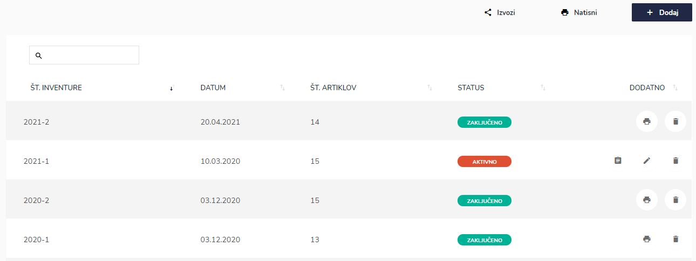
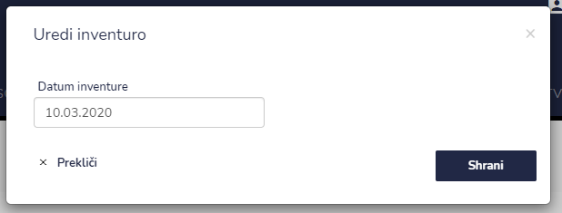
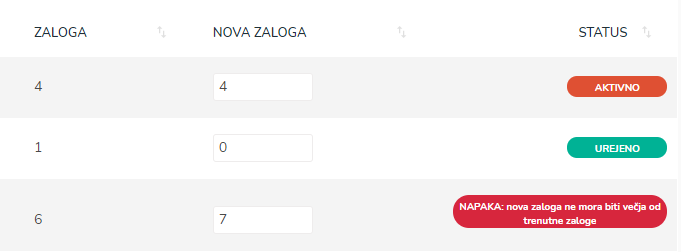
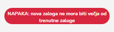
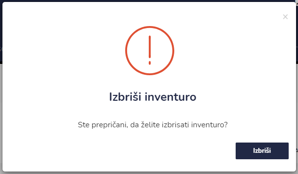
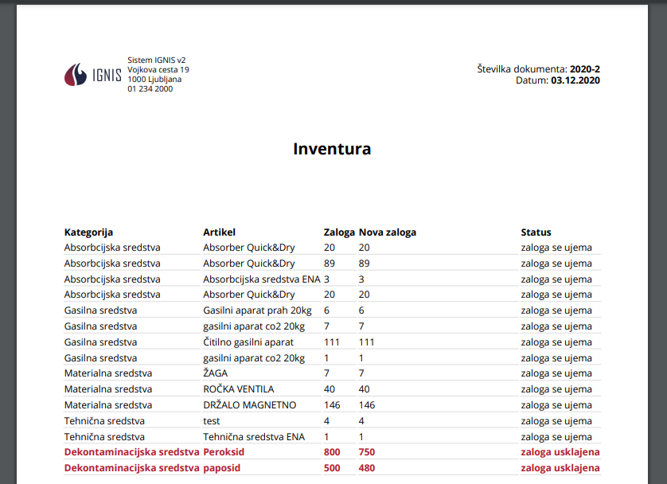
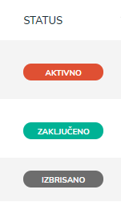

# Inventura

Tu dostopate do seznama inventur.


[uporaba-tabel-iskanje-sortiranje-izvozi-tiskanje.md](../ostalo/uporaba-tabel-iskanje-sortiranje-izvozi-tiskanje.md)





| Ime polja           | Opis polja                |
| ------------------- | ------------------------- |
| **Datum inventure** | Napišite datum inventure. |


Inventuro lahko urejate le ko ima status **AKTIVNO.**


V stolpcu NOVA ZALOGA popravljate zalogo za posamezen artikel

.PNG>)

v primeru, da je vpis količine večji od trenutne zaloge se izpiše napaka

popravite na pravo vrednost.

Ko ste vse artikle v inventuri pregledali in označili ter želite zaključiti inventuro to naredite s klikom na ikono **Zaključi**

Status inventure se spremeni iz **AKTIVNO** v **ZAKLJUČENO**.








.PNG>)



.png>)




## Kakšen status ima inventura?

V kakšnem statusu je inventura lahko vidite v stolpcu **Status**.

Inventura ima lahko status **aktivno, izbrisano** ali **aktivno.**

| **Status**     | Pomen                                                                      |
| -------------- | -------------------------------------------------------------------------- |
| **AKTIVNO**    | Tu lahko naredite inventuro opreme, urejate (poravite datum ali lokacijo). |
| **ZAKLJUČENO** | Tu posamezno inventuro prikažete v PDF ali pa jo izbrišete.                |
| **IZBRISANO**  | Inventura je izbrisana, ni možno urejanje.                                 |

