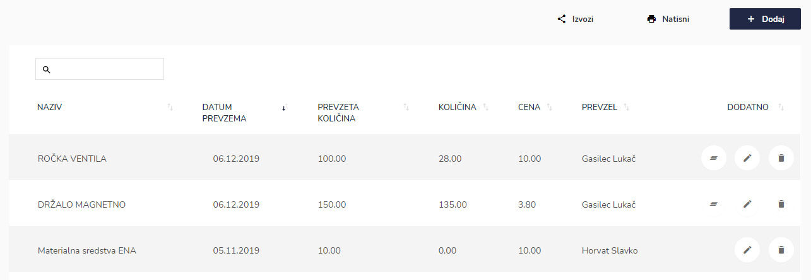
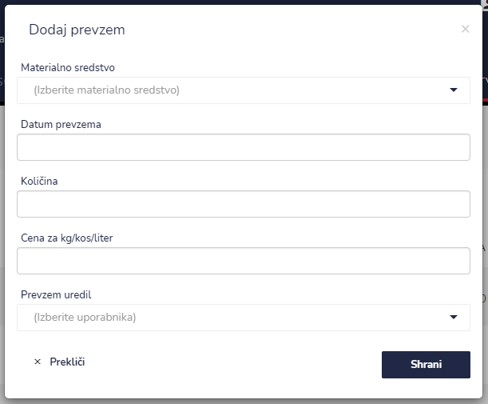
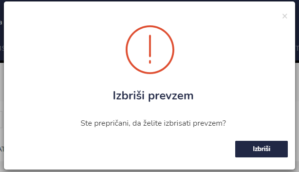
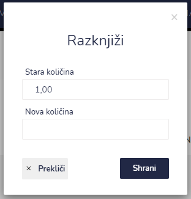

# Materialna sredstva

Tu dostopate do seznama prevzemov materialnih sredstev.


[uporaba-tabel-iskanje-sortiranje-izvozi-tiskanje.md](../ostalo/uporaba-tabel-iskanje-sortiranje-izvozi-tiskanje.md)




.png>)

| Ime polja                | Opis polja                                                             |
| ------------------------ | ---------------------------------------------------------------------- |
| **Materialno sredstvo**  | S pomočjo spustnega seznama izberite materialno sredstvo.              |
| **Datum prevzema**       | S pomočjo spustnega koledarja izberite datum prevzema.                 |
| **Količina**             | Napišite količino.                                                     |
| **Cena za kg/kos/liter** | Napišite ceno materialnega sredstva za kg/kos/liter.                   |
| **Prevzem uredil**       | S pomočjo spustnega seznama izberite osebo, katera je uredila prevzem. |









| Ime polja          | Opis polja                          |
| ------------------ | ----------------------------------- |
| **Stara količina** | Prikaz trenutne količine v sistemu. |
| **Nova količina**  | Dejanska količina v skladišču.      |


Če je količina sredstev enaka 0, ikone "Razknjiži" ni na voljo.




