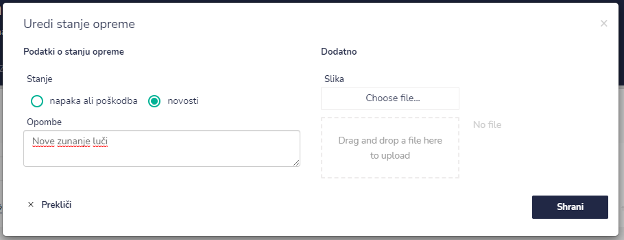

# Stanje opreme




| Ime polja                   | Opis polja                                                       |
| --------------------------- | ---------------------------------------------------------------- |
| **Podatki o stanju opreme** |                                                                  |
| **Stanje**                  | Označite stanje. Na voljo imate: napaka ali poškodba ali novost. |
| **Opombe**                  | Opišite dodatne opombe gleed stanja opreme.                      |
| **Dodatno**                 |                                                                  |
| **Slika**                   | Tu lahko naložite slike.                                         |





Izbrišete vpis le dokler ne zaključite vpisa.





Tu začnete izpolnjevati naslednje podatke:

| Ime polja      | Opis polja                                                             |
| -------------- | ---------------------------------------------------------------------- |
| **Opravljeno** | Označite ali je napaka opravljena ali ne.                              |
| **Odpravil**   | S pomočjo spustnega seznama izberite osebo, katera je opravila napako. |
| **Odgovor**    | Napišite krajši odgovor.                                               |

Ko ste vse podatke vpisali jih shranite s klikom na **Shrani.**&#x20;

Pri ikonah dodatno se spremeni iz ODPRAVLJENO v **ZAKLJUČI** .




S klikom na&#x20;

&#x20;

se vpis premakne v **ARHIV STANJ OPREME.**


