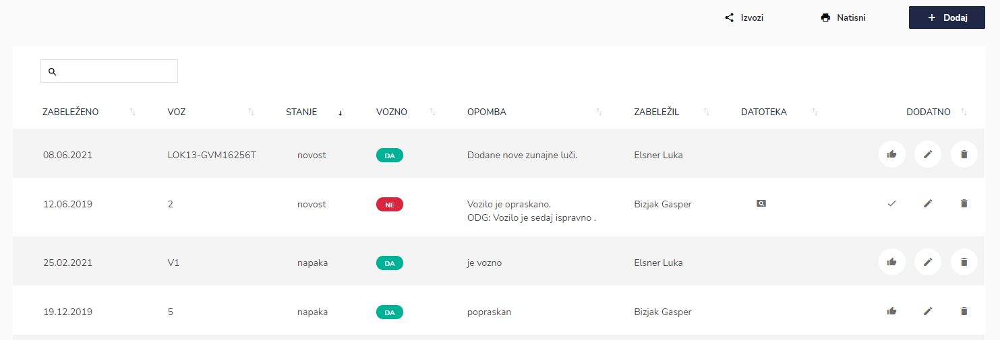
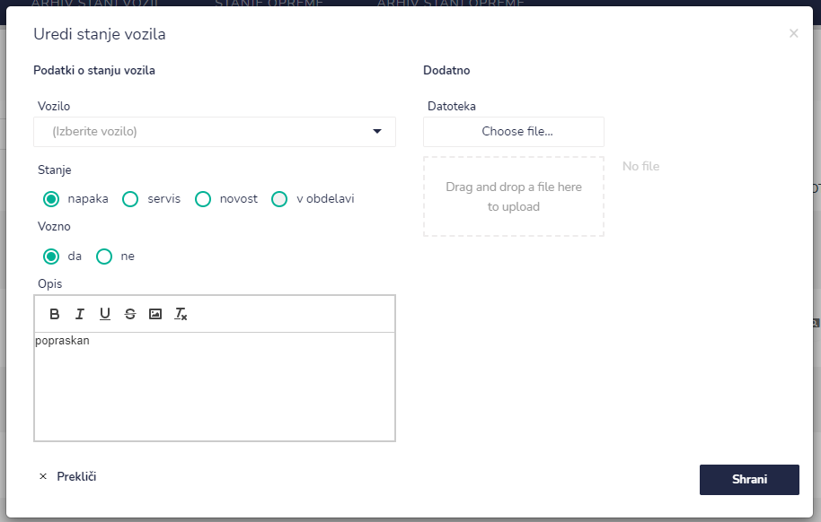
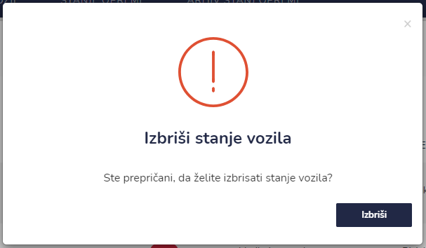
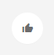
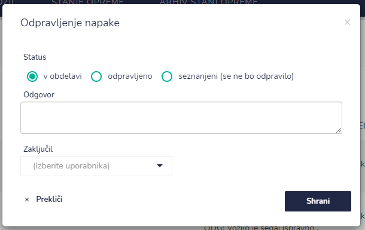
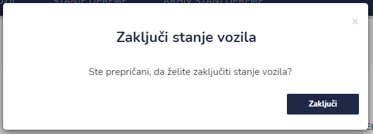

# Stanje vozil




| Ime polja                   | Opis polja                                                              |
| --------------------------- | ----------------------------------------------------------------------- |
| **Podatki o stanju vozila** |                                                                         |
| **Vozilo**                  | S pomočjo spustnega seznama izberite vozilo.                            |
| **Stanje**                  | Označite stanje. Na voljo imate: napaka, servis, novost ali v obdelavi. |
| **Vozno**                   | Označite ali je vozilo vozno ali ne.                                    |
| **Opis**                    | Opišite napako, servis, novost ali ali je vozilo v obdelavi.            |
| **Dodatno**                 |                                                                         |
| **Datoteka**                | Tu lahko naložite dodatne dokumente.                                    |








Tu začnete izpolnjevati naslednje podatke:

| Ime polja     | Opis polja                                                                 |
| ------------- | -------------------------------------------------------------------------- |
| **Status**    | Označite status: v obdelavi, opravljeno ali seznanjen (se ne bo opravilo). |
| **Odgovor**   | Napišite krajši odgovor.                                                   |
| **Zaključil** | Iz spustnega seznama izberite oseb, ki je zaključila opravljanje napake.   |

Ko ste vse podatke vpisali jih shranite s klikom na **Shrani.**&#x20;

Pri ikonah dodatno se spremeni iz ODPRAVLJENO v **ZAKLJUČI** .




S klikom na&#x20;

&#x20;

se vpis premakne v **ARHIV STANJ VOZIL.**



