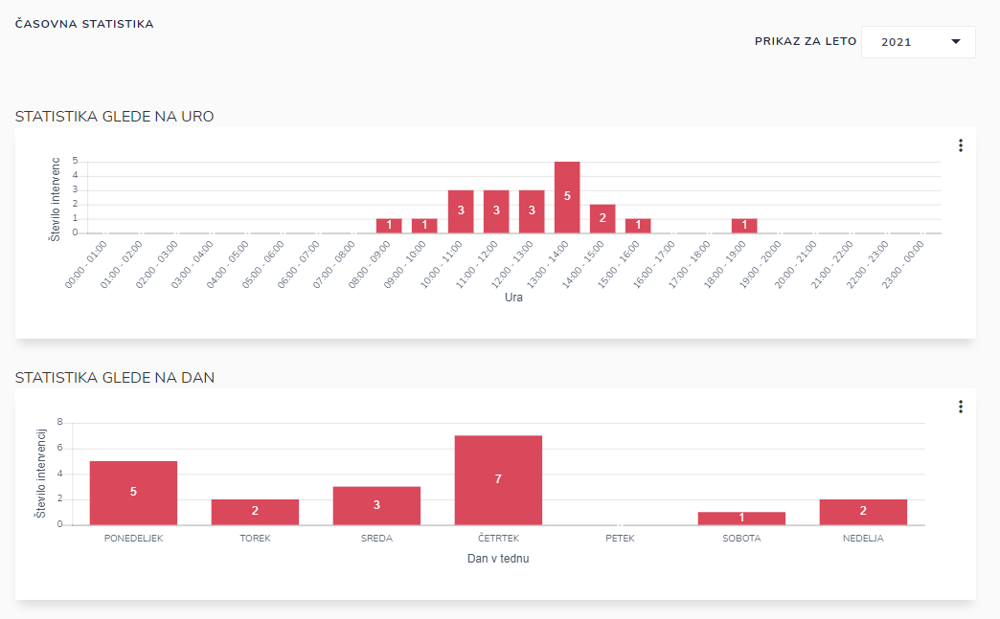
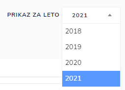

# Časovna

Tu dostopate do časovne statistike

Pregledujete lahko statistiko glede na:

* uro
* dan
* mesec
* izviz-prihod na mesto
* sočasnih intervencij

### Kako pregledati statistične podatke za določeno leto?

S klikom na leto, s pomočjo spustnega seznama izberite letnico

za katero želite pregledovati statistične podatke.

Z izbiro določenega časovnega obdobja lahko pregledujete statistiko za izbrano obdobje.

### Izvoz grafa v PDF dokument

S klikom na , pri posameznem grafu

in nato kliknite na  **Izvoz PDF**

&#x20;&#x20;

kjer se nato generira pdf dokument,

ki ga lahko natisnete, shranite, itd.
