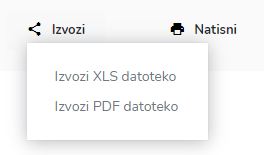

# Oprema

Tu dostopate do statistike opreme

### Kako pregledati statistične podatke za določeno časovno obdobje?

S klikom na datum izberite časovno obdobje

za katero želite pregledovati statistične podatke.

Z izbiro vozila&#x20;

lahko pregledujete statistiko tudi po izbranem vozilu.

### Izvoz grafa v PDF dokument

S klikom na  , pri posameznem grafu

in nato kliknite na  **Izvoz PDF**

&#x20;&#x20;

kjer se nato generira pdf dokument,

ki ga lahko natisnete, shranite, itd.

### Ali lahko seznam uporabljene opreme na intervenciji, v izbranem obdobju ter vozilu,  izvozim ali natisnem?

Da, seznam uporabljene opreme za določeno časovno obdobje in vozilo lahko tudi izvozite (xls ali pdf datoteka) ali natisnete. S klikom na ikono **Izvozi** (tu izbirate med izvozom XLS datoteko ali PDF datoteko) ali uporabite ikono **Natisni** za tiskanje.

S klikom na ikono **Izvozi** XLS datoteko, izvozite XLS datoteko:

S klikom na ikono **Izvozi** PDF datoteko, izvozite PDF datoteko:

