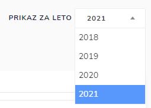

# Prevoz vode

Tu dostopate do statističnih podatkov prevoza vode

Pregledujete statistiko:

* prevoza vode glede na mesec
* prepeljane vode glede na mesev (m3)
* prevožene razdalje glede na mesec
* prevožene vode glede na naselje
* prevožene vode glede na občino

### Kako pregledati statistične podatke za določeno leto?

S klikom na leto, s pomočjo spustnega seznama izberite letnico

za katero želite pregledovati statistične podatke.

### Izvoz grafa v PDF dokument

S klikom na , pri posameznem grafu

in nato kliknite na  **Izvoz PDF**

&#x20;&#x20;

kjer se nato generira pdf dokument

