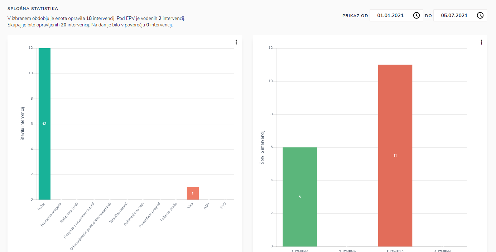
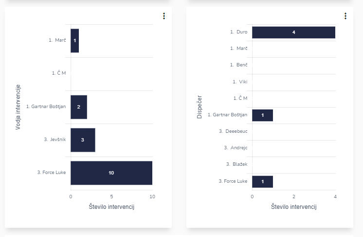
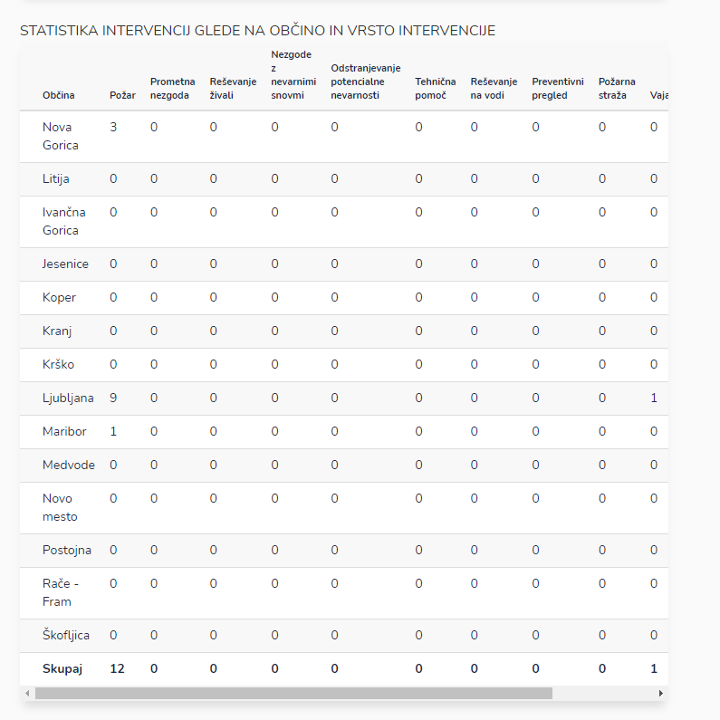
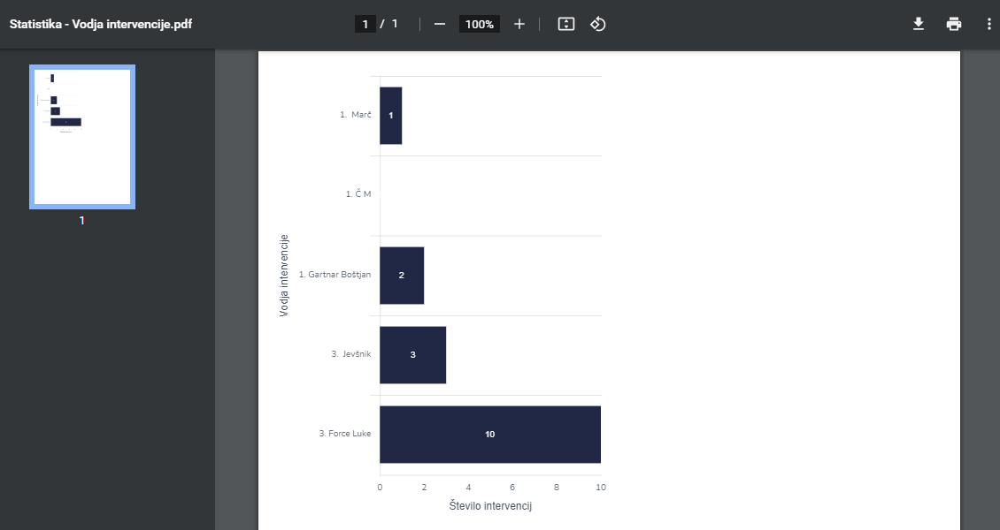

# Splošna

Tu dostopate do splošne statistike

Pregledujete statistiko:

* splošno (število intervencij glede na izmeno, vrsto prijave, vodjo intervencije, dispečerja)
* intervencij glede na občino in vrsto intervencije
* pogorele površine

### Kako pregledati statistične podatke za določeno časovno obdobje?

S klikom na datum izberite časovno obdobje

za katero želite pregledovati statistične podatke.

Z izbiro določenega časovnega obdobja lahko pregledujete statistiko za izbrano obdobje.

### Izvoz grafa v PDF dokument

S klikom na  , pri posameznem grafu

in nato kliknite na  **Izvoz PDF**

&#x20;&#x20;

kjer se nato generira pdf dokument,

ki ga lahko natisnete, shranite, itd.
