# Vaje

Tu dostopate do statistike vaj.

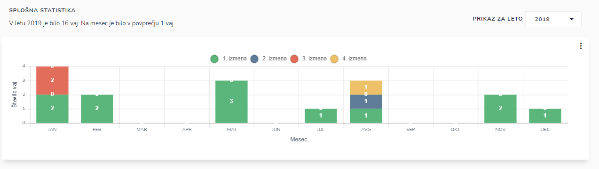

Pregledujete:

* splošno statistiko in
* podrobno statistiko (tu izbirate glede na kategorijo: vaja, zaposleni ali izmena)

## Kako pregledati statistične podatke za določeno leto?

S klikom na leto, s pomočjo spustnega seznama izberite letnico za katero želite pregledovati statistične podatke.

## Izvoz grafa v PDF dokument

S klikom na  , pri posameznem grafu

in nato na  ''**Izvoz PDF''**

&#x20;&#x20;

kjer se generira pdf dokument,

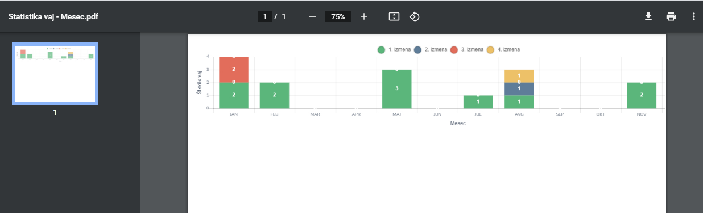

ki ga lahko natisnete, shranite, itd.

## Statistika VAJE - PODROBNA STATISTIKA

Izbirate lahko tudi kategorijo rezultatov glede na:

* VAJE
* ZAPOSLENI
* IZMENA

S klikom na  nadaljujete z naslednjimi koraki.&#x20;

S klikom na  pa že imate na voljo statističen prikaz.

S klikom na 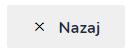 pa se vrnete na prejšni korak.

### **Izbor kategorije VAJE**&#x20;

**1. korak**&#x20;

V prvem koraku označite **VAJE**, &#x20;

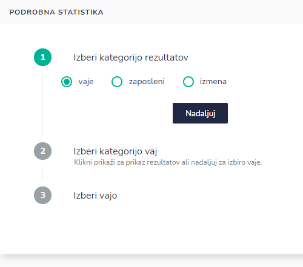

kliknite na ikono **Nadaljuj**

**2. korak**

kjer v drugem koraku izberete kategorijo vaj

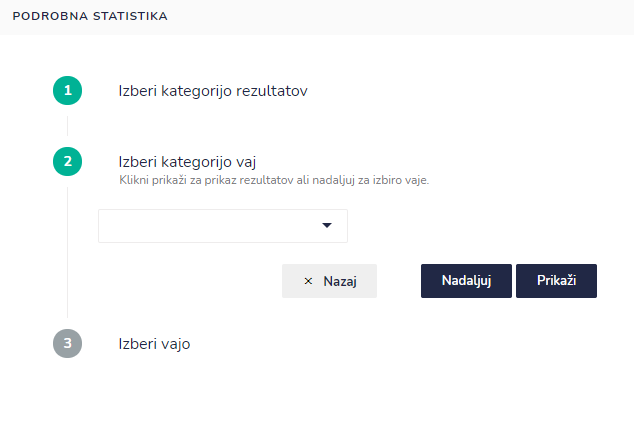

S pomočjo spustnega seznama izberite kategorijo

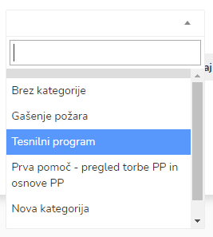

S klikom na  v tretjem koraku izberete vajo s pomočjo spustnega seznama.&#x20;

S klikom na  pa že imate na voljo statističen prikaz.

S klikom na  pa se vrnete na prejšni korak.

**3. korak**

V tretjem koraku izberite vajo s pomočjo spustnega seznama&#x20;

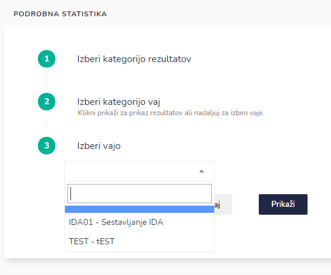

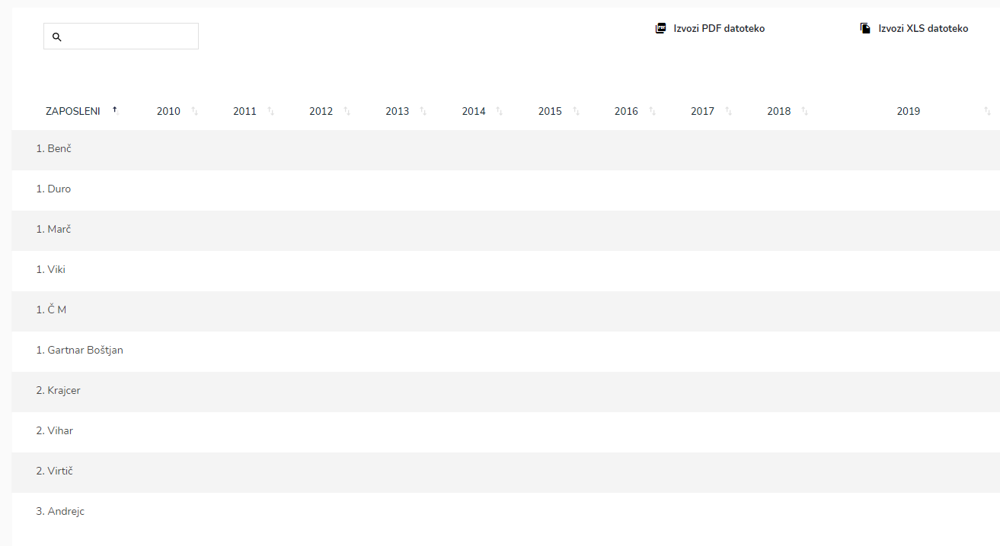

Podatke lahko:

* pregledate po letih
* pregled po opravljenih vajah

.PNG>)

Vse izbrane podatke pa lahko izvozite kot PDF ali XSL datoteko s klikom na&#x20;

.PNG>)

S klikom na ikono **Izvozi PDF datoteko**, izvozite PDF datoteko:

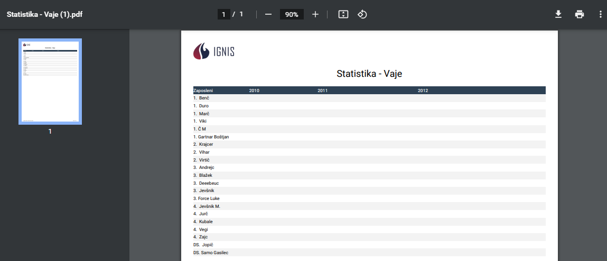

S klikom na ikono **Izvozi XLS datoteko**, izvozite XLS datoteko:

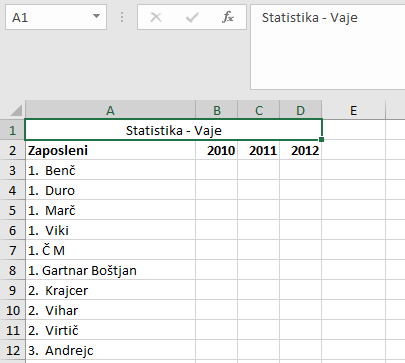

### **Izbor kategorije ZAPOSLENI**

**1. korak**

V prvem koraku označite **ZAPOSLENI**, &#x20;

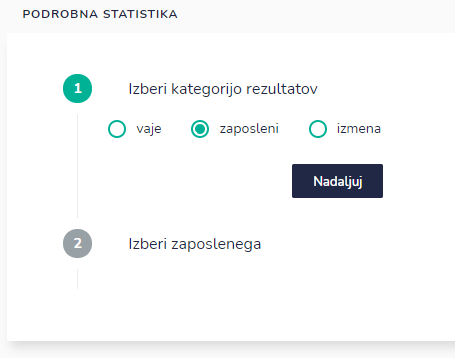

kliknite na ikono **Nadaljuj**

**2. korak**

kjer v drugem koraku izberete zaposlenega s pomočjo spustnega seznama&#x20;

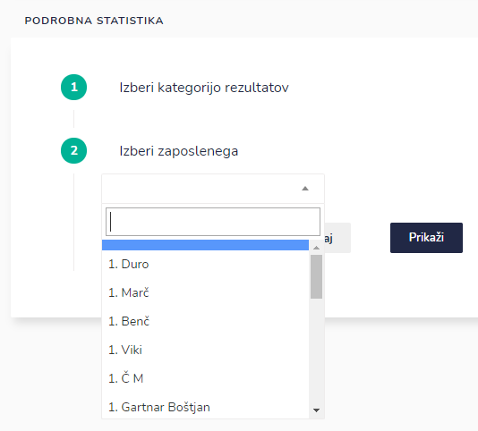

S klikom na  pa že imate na voljo statističen prikaz.

S klikom na  pa se vrnete na prejšni korak.

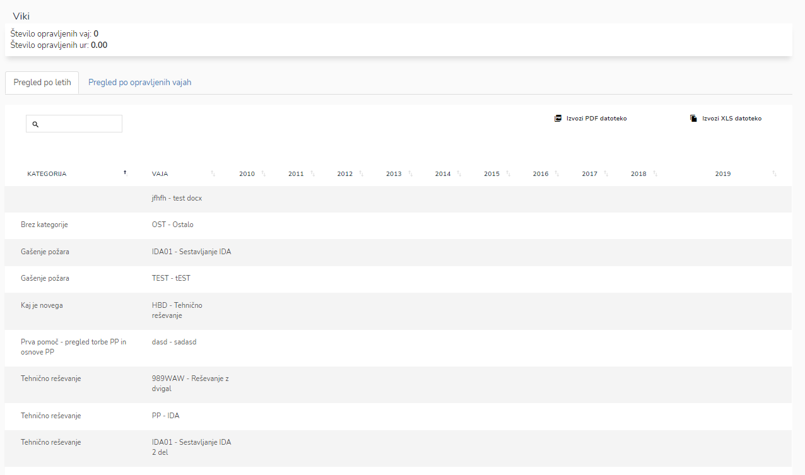

Podatke lahko:

* pregledate po letih ali
* pregled po opravljenih vajah.

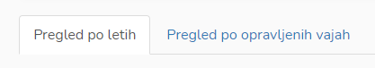

Vse izbrane podatke pa lahko izvozite kot PDF ali XSL datoteko s klikom na&#x20;

.PNG>)

S klikom na ikono **Izvozi PDF datoteko**, izvozite PDF datoteko:

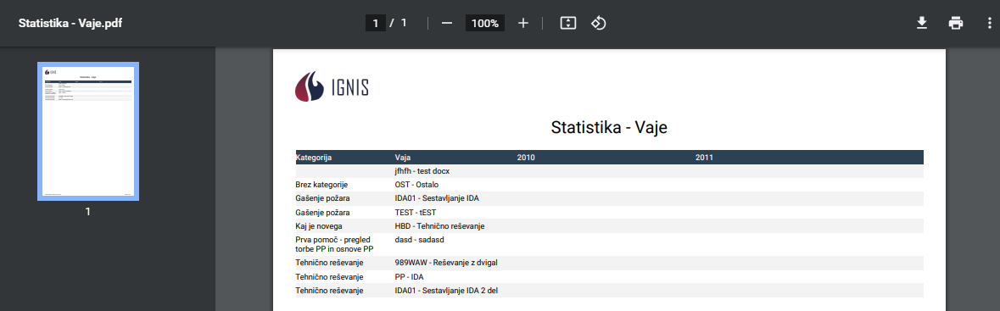

S klikom na ikono **Izvozi XLS datoteko**, izvozite XLS datoteko:

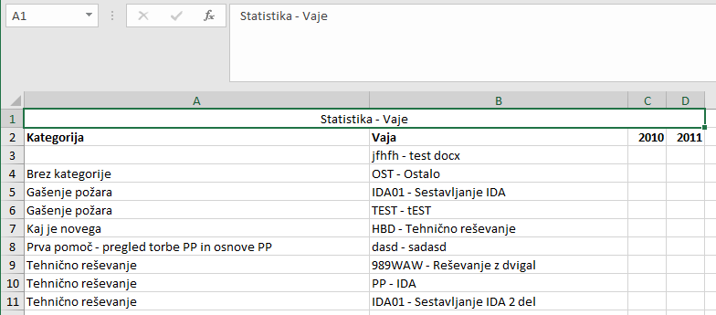

### **Izbor kategorije IZMENA**

**1. korak**

V prvem koraku označite **IZMENA**, &#x20;

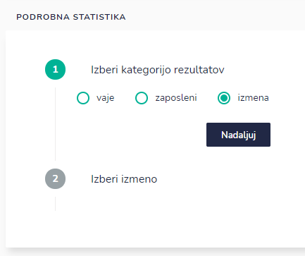

kliknite na ikono **Nadaljuj**

**2. korak**

kjer v drugem koraku izberete izmeno&#x20;

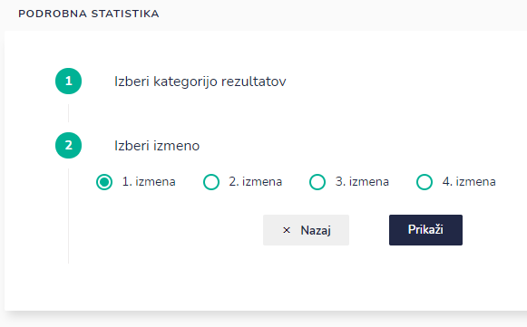

S klikom na  pa že imate na voljo statističen prikaz.

S klikom na  pa se vrnete na prejšni korak.

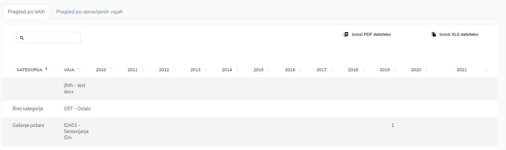

Podatke lahko:

* pregledate po letih ali
* pregled po opravljenih vajah.

Vse izbrane podatke pa lahko izvozite kot PDF ali XSL datoteko s klikom na&#x20;

.PNG>)

