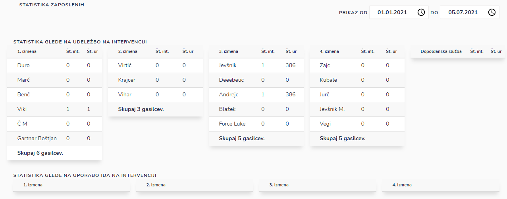

# Zaposleni

Tu dostopate do statistike zaposlenih

Pregledujete statistiko glede na:

* udeležbo na intervenciji
* uporabo IDA na intervenciji
* voznika na intervenciji
* opravljenih ur (delovnih nalog)

### Kako pregledati statistične podatke za določeno časovno obdobje?

S klikom na datum izberite časovno obdobje,

za katero želite pregledovati statistične podatke.

