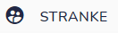
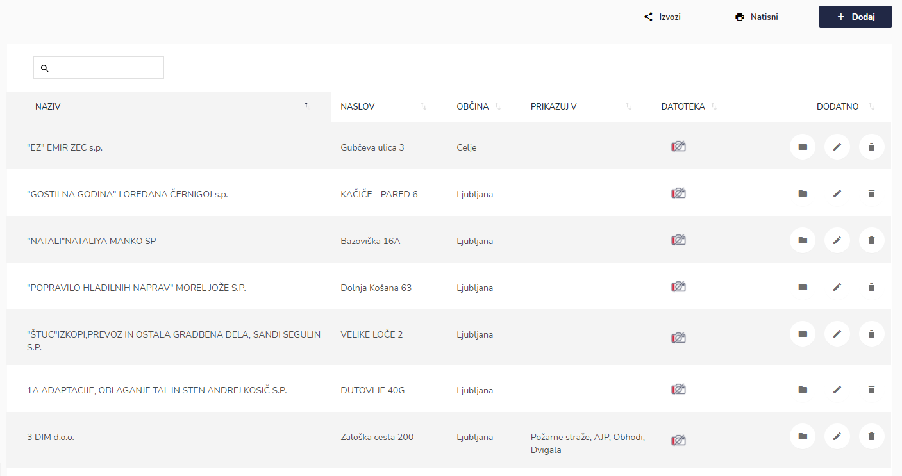
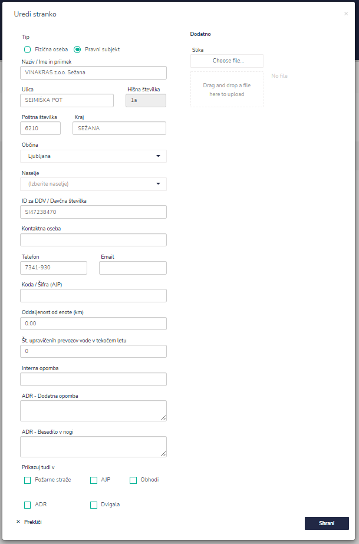
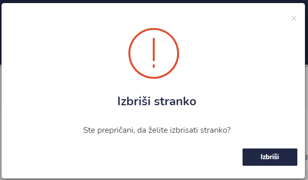
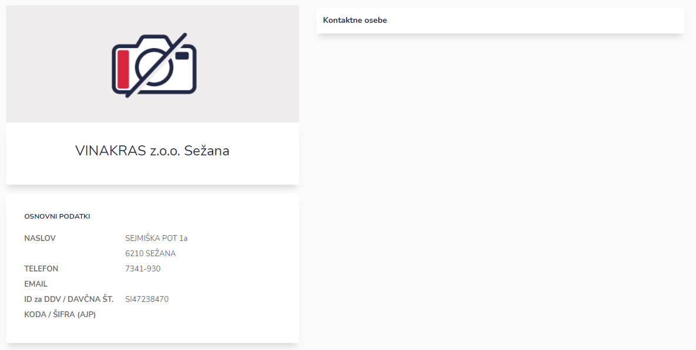

# STRANKE

Tu dostopate do seznama strank.


[uporaba-tabel-iskanje-sortiranje-izvozi-tiskanje.md](../ostalo/uporaba-tabel-iskanje-sortiranje-izvozi-tiskanje.md)





| Ime polja                                        | Opis polja                                                                                                                                                                                                                                                     |
| ------------------------------------------------ | -------------------------------------------------------------------------------------------------------------------------------------------------------------------------------------------------------------------------------------------------------------- |
| **Tip**                                          | Označite ali je stranka fizična oseba ali pravni subjekt.                                                                                                                                                                                                      |
| **Naziv / Ime in priimek**                       | Napišite ime in priimek oz naziv.                                                                                                                                                                                                                              |
| **Ulica**                                        | 
Tu vnesite ulico in hišno številko <strong>(indeksiranje google)</strong>

Pri vpisu nekaj črk, lahko s pomočjo spustnega seznama izberete ulico.

Ob izbiri ulice se avtomatsko izpolnijo naslednja polja: poštna številka, kraj in občina. 
 |
| **Hišna številka**                               |                                                                                                                                                                                                                                                                |
| **Kraj**                                         | Vpišite kraj.                                                                                                                                                                                                                                                  |
| **Občina**                                       | Vpišite občino.                                                                                                                                                                                                                                                |
| **Naselje**                                      | Napišite naselje, če obstaja.                                                                                                                                                                                                                                  |
| **ID za DDV / Davčna številka**                  | Vpišite davčno številko.                                                                                                                                                                                                                                       |
| **Kontaktna oseba**                              | Vpišite kontaktno osebo.                                                                                                                                                                                                                                       |
| **Telefon**                                      | Napišite telefonsko številko.                                                                                                                                                                                                                                  |
| **Email**                                        | Vpišite elektronski naslov.                                                                                                                                                                                                                                    |
| **Koda / Šifra (AJP)**                           | Vpišite kodo oz. šifro AJP.                                                                                                                                                                                                                                    |
| **Oddaljenost od enote (km)**                    | Vpišite razdaljo od naslovnika do enote v kilometrih (km).                                                                                                                                                                                                     |
| **Št. upravičenih prevozov vode v tekočem letu** | Vpišite število upravičenih prevozov vode, če jih stranka ima.                                                                                                                                                                                                 |
| **Interna opomba**                               | Dopišite interne opombe.                                                                                                                                                                                                                                       |
| **ADR - Dodatna opomba**                         | Dopišite ADR opombe.                                                                                                                                                                                                                                           |
| **ADR - Besedilo v nogi**                        | Napišite ADR -  besedilo v nogi.                                                                                                                                                                                                                               |
| **Prikazuj tudi v**                              | 
Označite možnosti kje se prikazuje stranka. Na voljo imate: 

požarne straže, AJP, obhodi ADR in dvigala.
                                                                                                                                          |
| _**Dodatno**_                                    |                                                                                                                                                                                                                                                                |
| **Slika**                                        | Dodajte sliko.                                                                                                                                                                                                                                                 |









Tu urejate in dodajate podatke za posamezno stranko.

.PNG>)



### **Kako urejati podatke za posamezno stranko?**

S klikom na ikono **Profil stranke**

se odpre profil stranke

V zgornji vrstici&#x20;

.PNG>)

lahko urejate in dodajate podatke za posamezno stranko s klikom na posamezne zavihke

* **Kontaktne osebe**
* **Požarni načrt**
* **Prostori / objekt**
* **Reg. številke**
* **Opozorila**

