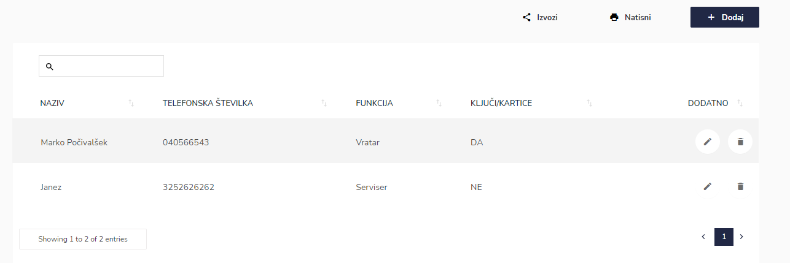
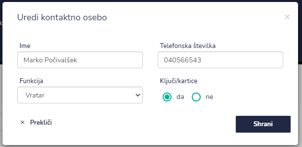

# Kontaktne osebe

Tu dostopate do kontaktnih podatkov pri posamezni stranki.


[uporaba-tabel-iskanje-sortiranje-izvozi-tiskanje.md](../ostalo/uporaba-tabel-iskanje-sortiranje-izvozi-tiskanje.md)





| Ime polja               | Opis polja                                     |
| ----------------------- | ---------------------------------------------- |
| **Ime**                 | Napišite ime in priimek kontaktne osebe.       |
| **Funkcija**            | S pomočjo spustnega seznama izberite funkcijo. |
| **Telefonska številka** | Vpišite kontaktno številko.                    |
| **Ključi/kartica**      | Označite ali oseba ključe/kartico.             |







