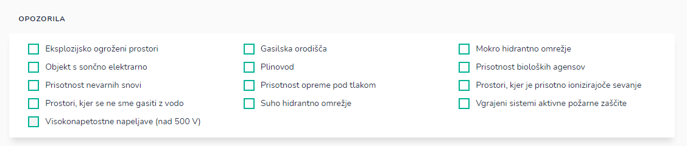

# Opozorila

Tu dodostopate do opozoril pri posamezni stranki.

Izbirate med naslednjimi opozorili

* Eksplozijsko ogroženi prostori
* Objekt s sončno elektrarno
* Prisotnost nevarnih snovi
* Prostori, ker se ne sme gasiti z vodo
* Viskonapetostne napeljave (nad 500 V)
* Gasilska orodišča
* Plinovod
* Prisotnost opreme pod tlakom
* Suho hidrantno območje
* Mokro hidrantno omrežje
* Prisotnost bioloških agensov
* Prostori, ker je prisotno ionizirajoče sevanje
* Vgrajeni sistemi požarne zaščite

Ko označite posamezno opozorilo se pojavi okno, da ste uspešno shranili opozorilo.

