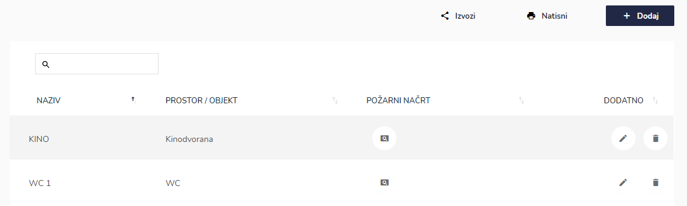
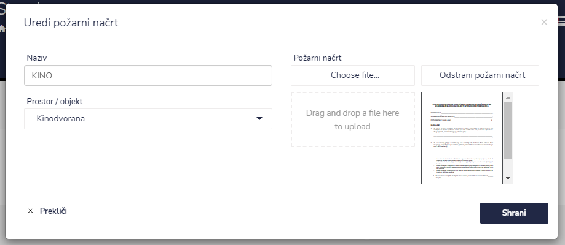

# Požarni načrti

Tu dostopate do požarnih načrtov pri posamezni stranki


[uporaba-tabel-iskanje-sortiranje-izvozi-tiskanje.md](../ostalo/uporaba-tabel-iskanje-sortiranje-izvozi-tiskanje.md)





| Ime polja            | Opis polja                                                |
| -------------------- | --------------------------------------------------------- |
| **Naziv**            | Napišite ime požarnega načrta.                            |
| **Prostor / objekt** | S pomočjo spustnega seznama izberite prostor oz. objekt.  |
| **Požarni načrt**    | Dodajte datoteko.                                         |








Požarni načrt lahko dodate tudi pri DOKUMENTI -> Požarni načrti



[pozarni-nacrti.md](../dokumenti/pozarni-nacrti.md)


