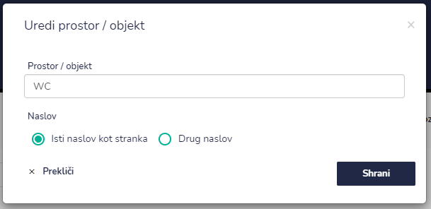

# Prostori / objekti

Tu dostopate do prostorov / objektov pri posamezni stranki.


[uporaba-tabel-iskanje-sortiranje-izvozi-tiskanje.md](../ostalo/uporaba-tabel-iskanje-sortiranje-izvozi-tiskanje.md)





| Ime polja            | Opis polja                                                                                                                                                             |
| -------------------- | ---------------------------------------------------------------------------------------------------------------------------------------------------------------------- |
| **Prostor / objekt** | Napišite ime prostora oz. objekta.                                                                                                                                     |
| **Naslov**           | 
Označite ali je naslov isti kot od stranke. 

Če označite, da ni, dopišite ulico in hišno številko ter izberite občino s pomočjo spustnega seznama.

 |

.png>)


Ulico izberite katero vam ponudi Google, hišna številka se bo vnesla sama. Primer vnosa je na zgornji sliki.








