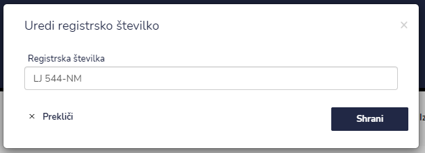

# Reg. številke

Tu dostopate do registerskih številk pri posamezni stranki.

.PNG>)


[uporaba-tabel-iskanje-sortiranje-izvozi-tiskanje.md](../ostalo/uporaba-tabel-iskanje-sortiranje-izvozi-tiskanje.md)





| Ime polja               | Opis polja                           |
| ----------------------- | ------------------------------------ |
| **Registrska številka** | Napišite registrsko številko vozila. |







