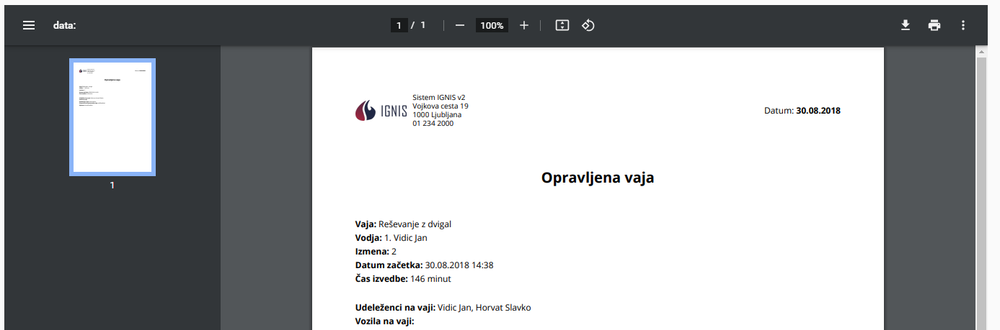

# Arhiv usposabljanj


[uporaba-tabel-iskanje-sortiranje-izvozi-tiskanje.md](../ostalo/uporaba-tabel-iskanje-sortiranje-izvozi-tiskanje.md)









| Ime polja                                                       | Opis polja                                                                                                         |
| --------------------------------------------------------------- | ------------------------------------------------------------------------------------------------------------------ |
| **Kategorija**                                                  | Iz spustnega seznama izberite kategorijo usposabljanja.                                                            |
| **Vaja**                                                        | Iz spustnega seznama izberite vajo.                                                                                |
| **Datum začetka**                                               | S pomočjo spustnega koledarja izberite dan in uro začetka.                                                         |
| **Datum konca**                                                 | S pomočjo spustnega koledarja izberite dan in uro konca.                                                           |
| **Vodja vaje**                                                  | Iz spustnega seznama izberite vodjo vaje.                                                                          |
| **Izmena**                                                      | Izberite s pomočjo spustnega seznama izberite izmeno.                                                              |
| **Udeleženci na vaji**                                          | Iz spustnega seznama izberite udeležence za usposabljanje.                                                         |
| **Vozila na vaji**                                              | Iz spustnega seznama izberite vozila.                                                                              |
| **Poudarki iz vaje**                                            | Tu napišete podarke usposabljenja.                                                                                 |
| **Priporočila za spremembo vaje**                               | Tu zapišete pripombe, dodatke k vaji,...                                                                           |
| **Poškodovana oprema na vaji, predlogi za zamenjavo ali nakup** | Tu zapišete ali se na usposabljanju poškodovala oprema ali imate še kakšne predloge za zamenjavo ali nakup opreme. |








