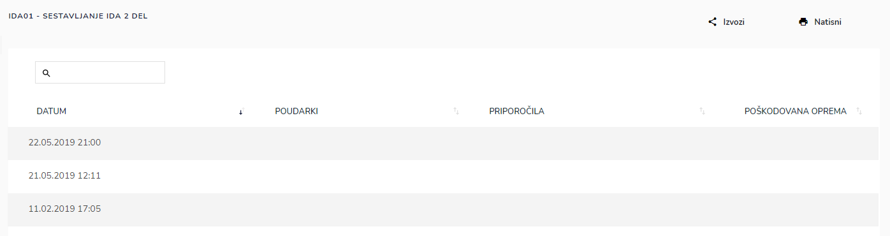

# Seznam usposabljanj

.PNG>)


[uporaba-tabel-iskanje-sortiranje-izvozi-tiskanje.md](../ostalo/uporaba-tabel-iskanje-sortiranje-izvozi-tiskanje.md)









| Ime polja      | Opis polja                                                                                |
| -------------- | ----------------------------------------------------------------------------------------- |
| **Šifra**      | Napišite šifro usposabljanja                                                              |
| **Naziv**      | Ime usposabljanja                                                                         |
| **Kategorija** | Iz spustnega seznama izberite kategorijo usposabljanja                                    |
| **Datoteka**   | Dodajte dokumente, kateri so pomebni za usposabljanje, npr. slike, pdf ali doc dokumenti. |








