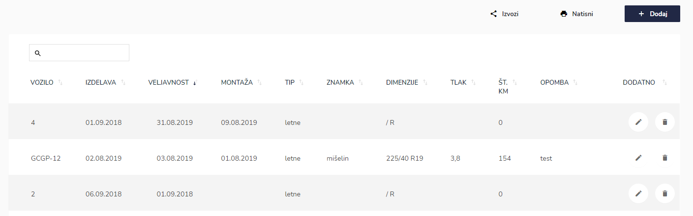
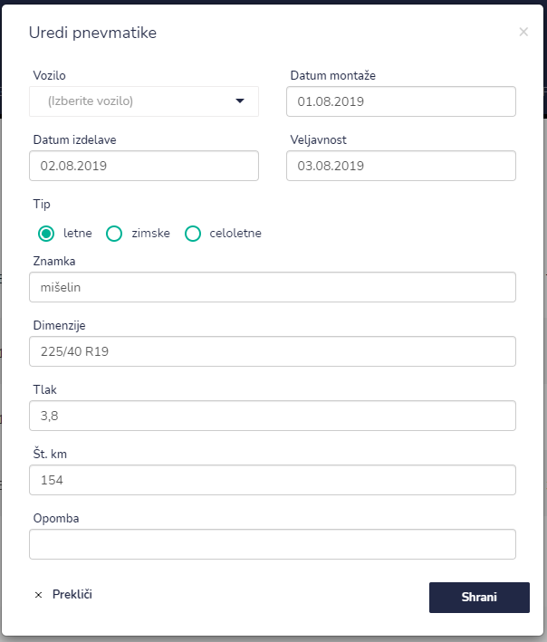
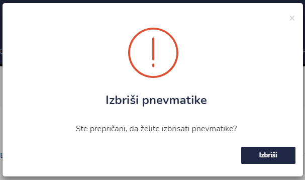

# Pnevmatike


[uporaba-tabel-iskanje-sortiranje-izvozi-tiskanje.md](../ostalo/uporaba-tabel-iskanje-sortiranje-izvozi-tiskanje.md)





| Ime polja          | Opis polja                                                        |
| ------------------ | ----------------------------------------------------------------- |
| **Datum montaže**  | S pomočjo koledarja izberite datum montaže pnevmatik.             |
| **Datum izdelave** | S pomočjo koledarja izberite datum montaže pnevmatik.             |
| **Veljavnost**     | S pomočjo koledarja izberite datum veljavnosti pnevmatik.         |
| **Tip pregleda**   | Označite za kakšen tip pnevmatik so: letne, zimske ali celoletne. |
| **Znamka**         | Napišite znamko pnevmatik.                                        |
| **Dimenzija**      | Napišite dimenzijo pnevmatik, npr. 200/55 R16.                    |
| **Tlak**           | Napišite tlak.                                                    |
| **Št. km**         |                                                                   |
| **Opombe**         | Dopišite opombe.                                                  |








###

