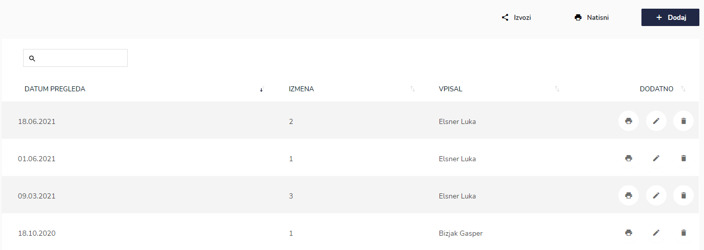
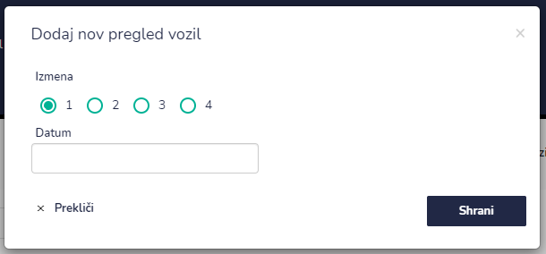
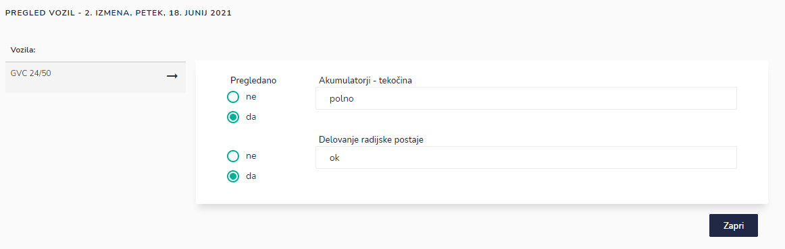
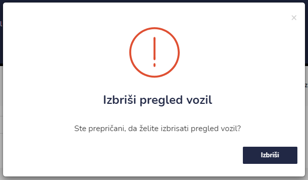
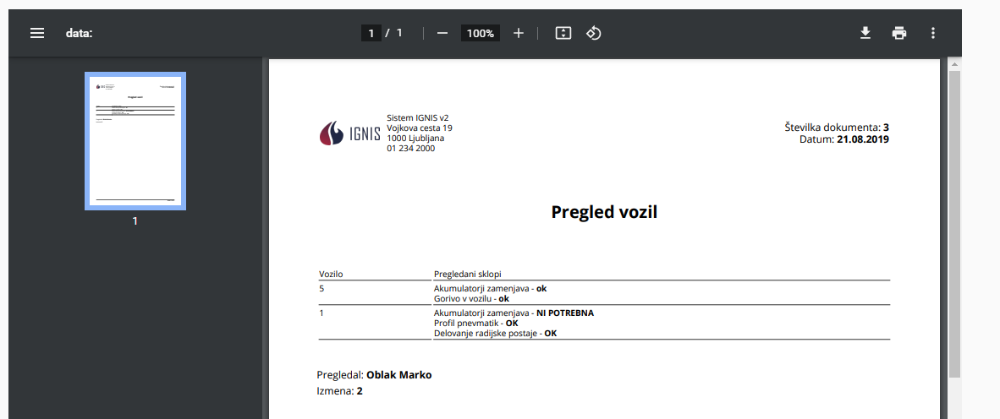

# Pregled vozil


[uporaba-tabel-iskanje-sortiranje-izvozi-tiskanje.md](../ostalo/uporaba-tabel-iskanje-sortiranje-izvozi-tiskanje.md)





| Ime polja  | Opis polja                                   |
| ---------- | -------------------------------------------- |
| **Izmena** | Označite katera izmena bo pregledala vozila. |
| **Datum**  | S pomočjo koledarja napišite datum.          |

Ko imate vpisane vse podatke s klikom na **Shrani**, shranite pregled vozil.

Odpre se okno kjer začnete izpolnjevati podatke ob pregledu vozil.

.PNG>)





Ko imate vse podatke popravljene in vpisane okno zaprete s klikom na **Zapri**. Vrnete se nazaj na celoten seznam pregled vozil.











###

