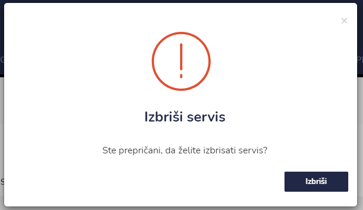

# Servisi


[uporaba-tabel-iskanje-sortiranje-izvozi-tiskanje.md](../ostalo/uporaba-tabel-iskanje-sortiranje-izvozi-tiskanje.md)





| Ime polja         | Opis polja                                                                                                                              |
| ----------------- | --------------------------------------------------------------------------------------------------------------------------------------- |
| **Vozilo**        | Iz spustnega seznama izberite vozilo.                                                                                                   |
| **Datum servisa** | S pomočjo koledarja napišite datum servis.                                                                                              |
| **Velja**         | Iz spustnega seznama izberite veljavnost servisa. Na voljo imate: 1 mesec, 2 meseca, 3 mesece, 6 mesecev, 1 leto, 2 leti ali neomejeno. |
| **Tip servisa**   | Označite ali gre za redni, obdobni ali izredni servis vozila.                                                                           |
| **Opombe**        | Dopišite opombe.                                                                                                                        |







###

