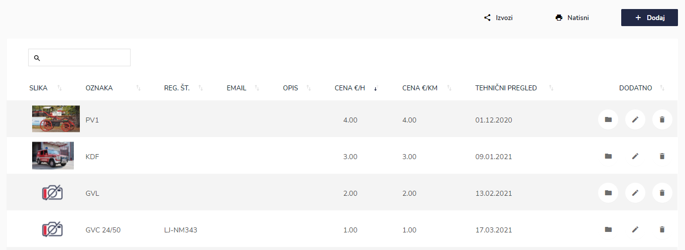
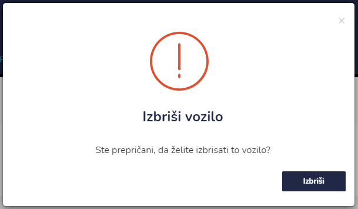
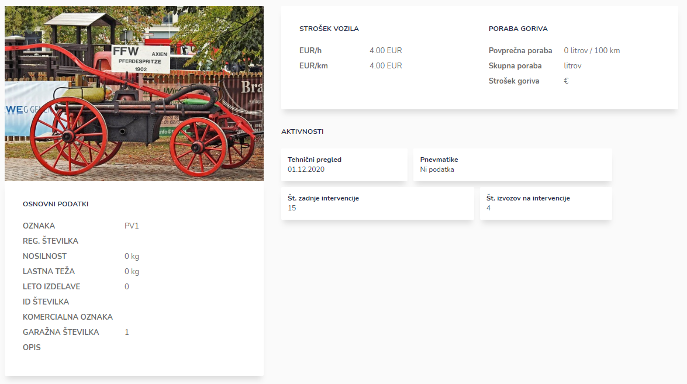

# Seznam vozil


[uporaba-tabel-iskanje-sortiranje-izvozi-tiskanje.md](../ostalo/uporaba-tabel-iskanje-sortiranje-izvozi-tiskanje.md)





| Ime polja                           | Opis polja                                          |
| ----------------------------------- | --------------------------------------------------- |
| **PODATKI O VOZILU**                |                                                     |
| **Oznaka**                          | Iz spustnega seznama izberite zaposlenega.          |
| **Registrska številka**             | Iz spustnega seznama izberite izmeno.               |
| **Nosilnost (kg)**                  |                                                     |
| **Lastna teža (kg)**                |                                                     |
| **Leto izdelave**                   |                                                     |
| **ID številka**                     |                                                     |
| **Komercialna oznaka**              |                                                     |
| **Garažna številka**                |                                                     |
| **Email**                           |                                                     |
| **Števec**                          |                                                     |
| **Opis**                            |                                                     |
| **Sledat ID (sled. in navigacija)** |                                                     |
| **Vrstni red**                      |                                                     |
| **Garaža / Pozicija**               | Označite pozicijo: 1, 2, 3, 4 ali brez.             |
| **Prikaži v statistiki**            | Označite ali se vozilo prikaže v statistiki ali ne. |
| **STROŠEK VOZILA**                  |                                                     |
| **Cena EUR / delovna ura**          | Vpišite ceno delovne ure v €.                       |
| **Cena EUR / km**                   | Vpišite ceno kilometra v €.                         |
| **SPIN**                            |                                                     |
| **SPIN vozilo**                     | S pomočjo spustnega seznama izberite vozilo.        |
| **SPIN vrsta vozila**               | S pomočjo spustnega seznama vrsto vozilo.           |
| **DODATNO**                         |                                                     |
| **Slika**                           | Tu lahko dodate sliko vozila.                       |










