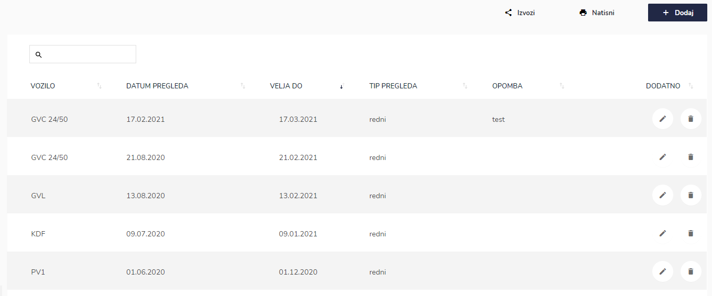
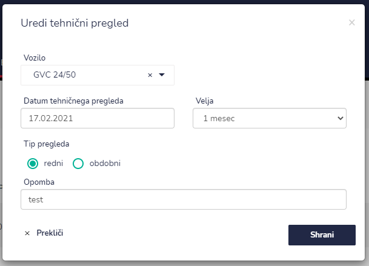
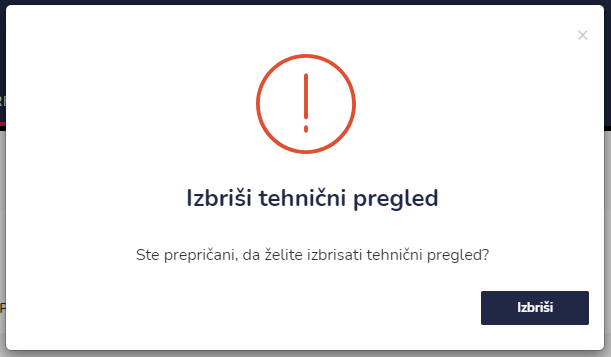

# Tehnični pregledi


[uporaba-tabel-iskanje-sortiranje-izvozi-tiskanje.md](../ostalo/uporaba-tabel-iskanje-sortiranje-izvozi-tiskanje.md)





| Ime polja                     | Opis polja                                                                                                                                       |
| ----------------------------- | ------------------------------------------------------------------------------------------------------------------------------------------------ |
| **Datum tehničnega pregleda** | S pomočjo koledarja napišite datum.                                                                                                              |
| **Veljavnost**                | Iz spustnega seznama izberite veljavnost tehničnega pregleda. Na voljo imate: 1 mesec, 2 meseca, 3 mesece, 6 mesecev, 1 leto, 2 leti ali 4 leta. |
| **Tip pregleda**              | Označite ali gre za redni ali obdobni pregled vozila.                                                                                            |
| **Opombe**                    | Dopišite opombe.                                                                                                                                 |







###

