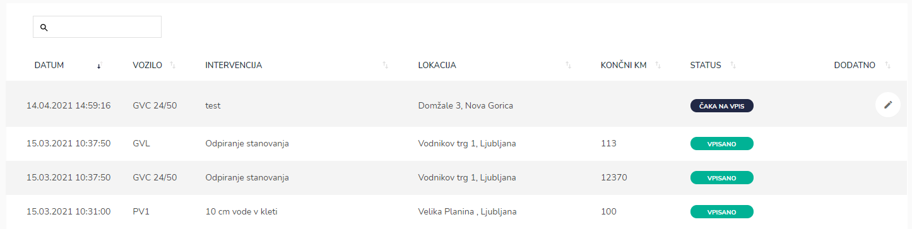
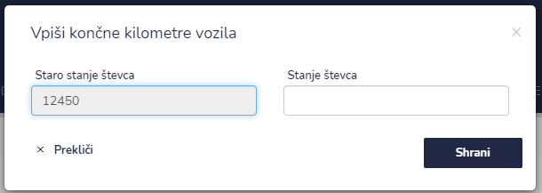
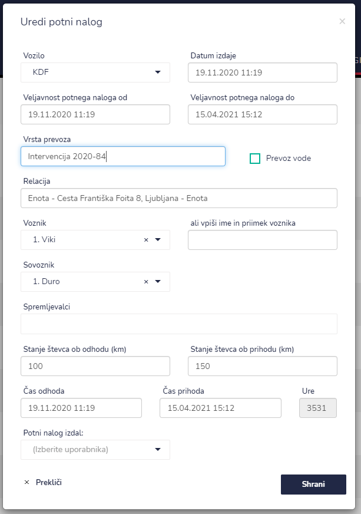

# Vpis kilometrov

Ta sklop je namenjen voznikom. Ko se vrnejo iz intervencije, lahko na tem mestu vnesejo končne kilometre na vozilu. Avtomatsko se glede na to zgenerira potni nalog.


[uporaba-tabel-iskanje-sortiranje-izvozi-tiskanje.md](../ostalo/uporaba-tabel-iskanje-sortiranje-izvozi-tiskanje.md)


## Vpis kilometrov pri izbrani/zaključeni intervenciji

Ko vpišite stanje števca s klikom na ikono **Shrani,** shranite vnos.

Odpre se okno Uredi potni nalog

tu lahko popravljate ali dopolnite potni nalog z manjkajočim podatki.&#x20;

Ko imate vse podatke popravljene in vpisane jih shranite s klikom na **Shrani**.&#x20;

Status pri vpisu kilometrov se spremeni iz **ČAKA NA VPIS** v **VPISANO.**

### Pomen statusa pri vpisu kilometrov

V kakšnem statusu je vpis kilometrov lahko vidite v stolpcu **Status**.

| Status           | Pomen                                          |
| ---------------- | ---------------------------------------------- |
| **ČAKA NA VPIS** | Tu je potrebno vnesti končne kilometre vozila. |
| **VPISANO**      | Tu so bili že vpisani kilometri.               |
