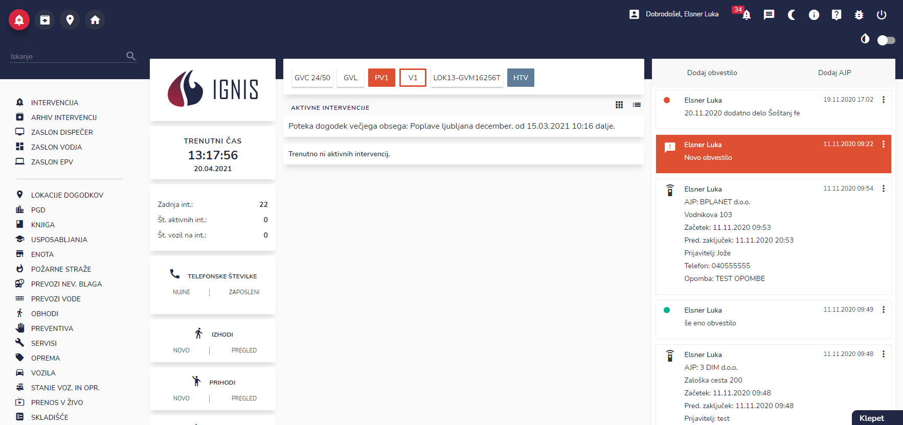

# ZASLON DISPEČER

Zaslon dispečer je namenjen dispečerjem v enoti. Na zaslonu so prikazane vse informacije, ki so pomembne za dispečerja in sicer:

* aktivne intervencije
* aktivna obvestila in AJP obvestila
* statusi vozil v enoti
* telefonske številke (zaposleni, nujne)
* izhodi iz enote
* prihodi v enoto
* vpoklici
* SMS obveščanje (povezava z FLORJAN-SMS), pregled odzivnosti zaposlenih
* klepet
* prenos v živo (drone, mobitel, tablični računalnik)

